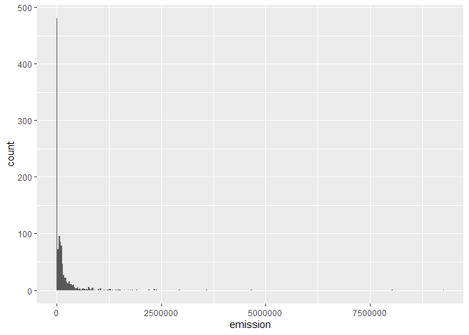
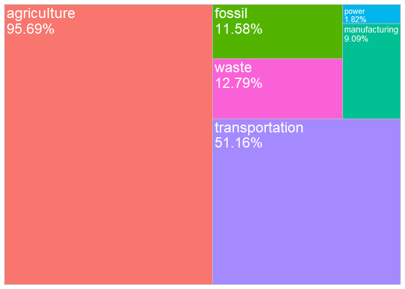

<!-- README.md is generated from README.Rmd. Please edit that file -->

# climate-trace-br

## Aquisição dos dados

  

 \## Carregando Pacotes

``` r
library(tidyverse)
library(geobr)
source("R/gafico.R")
```

### Carregando as bases de dados

``` r
emissions_sources <- read_rds("data/emissions_sources.rds") %>% 
  mutate(source_name_1 = str_to_title(source_name))
states <- read_rds("data/states.rds") %>% 
  mutate(name_region = ifelse(name_region == "Centro Oeste","Centro-Oeste",name_region))

brazil_ids <- read_rds("data/df_nome.rds")
glimpse(emissions_sources)
#> Rows: 2,853,440
#> Columns: 30
#> $ source_id                 <int> 10805081, 10722332, 10722332, 10722332, 1072…
#> $ iso3_country              <chr> "BRA", "BRA", "BRA", "BRA", "BRA", "BRA", "B…
#> $ original_inventory_sector <chr> "cropland-fires", "cropland-fires", "croplan…
#> $ start_time                <date> 2022-01-01, 2022-01-01, 2022-01-01, 2022-01…
#> $ end_time                  <date> 2022-12-31, 2022-12-31, 2022-12-31, 2022-12…
#> $ temporal_granularity      <chr> "annual", "annual", "annual", "annual", "ann…
#> $ gas                       <chr> "co2", "co2", "ch4", "n2o", "co2e_100yr", "c…
#> $ emissions_quantity        <dbl> 11058.3448, 7718135.9166, 13755.0934, 356.61…
#> $ created_date              <date> 2023-11-03, 2023-11-03, 2023-11-03, 2023-11…
#> $ modified_date             <date> 2023-11-03, 2023-11-03, 2023-11-03, 2023-11…
#> $ source_name               <chr> "Coqueiro Seco", "Pernambuco", "Pernambuco",…
#> $ source_type               <chr> NA, NA, NA, NA, NA, NA, NA, NA, NA, NA, NA, …
#> $ lat                       <dbl> -9.642262, -8.325216, -8.325216, -8.325216, …
#> $ lon                       <dbl> -35.80874, -37.99768, -37.99768, -37.99768, …
#> $ geometry_ref              <chr> "gadm_BRA.2.23_2", "gadm_BRA.17_1", "gadm_BR…
#> $ directory                 <chr> "data-raw/BRA/agriculture/cropland-fires_emi…
#> $ emissions_factor          <dbl> NA, NA, NA, NA, NA, NA, NA, NA, NA, NA, NA, …
#> $ emissions_factor_units    <chr> NA, NA, NA, NA, NA, NA, NA, NA, NA, NA, NA, …
#> $ capacity                  <dbl> NA, NA, NA, NA, NA, NA, NA, NA, NA, NA, NA, …
#> $ capacity_units            <chr> NA, NA, NA, NA, NA, NA, NA, NA, NA, NA, NA, …
#> $ capacity_factor           <dbl> NA, NA, NA, NA, NA, NA, NA, NA, NA, NA, NA, …
#> $ activity                  <dbl> NA, NA, NA, NA, NA, NA, NA, NA, NA, NA, NA, …
#> $ activity_units            <chr> NA, NA, NA, NA, NA, NA, NA, NA, NA, NA, NA, …
#> $ year                      <dbl> 2022, 2022, 2022, 2022, 2022, 2022, 2017, 20…
#> $ sector_name               <chr> "agriculture", "agriculture", "agriculture",…
#> $ sub_sector                <chr> "cropland-fires", "cropland-fires", "croplan…
#> $ sigla_uf                  <chr> "AL", "PE", "PE", "PE", "PE", "PE", "PE", "P…
#> $ nome_regiao               <chr> "Nordeste", "Nordeste", "Nordeste", "Nordest…
#> $ city_ref                  <chr> "Coqueiro Seco", "Betânia", "Betânia", "Betâ…
#> $ source_name_1             <chr> "Coqueiro Seco", "Pernambuco", "Pernambuco",…
nomes_uf <- c(brazil_ids$nome_uf %>% unique(),"Brazil")
abbrev_states <- brazil_ids$sigla_uf %>% unique()
region_names <- brazil_ids$nome_regiao %>% unique()
```

### tabela resumo

``` r
emissions_sources %>% 
  filter(
    year == 2022,
    gas == "co2e_100yr",
    !source_name %in% nomes_uf,
    !sub_sector %in% c("forest-land-clearing",
                            "forest-land-degradation",
                            "shrubgrass-fires",
                            "forest-land-fires",
                            "wetland-fires",
                            "removals")
    ) %>% 
  group_by(source_name) %>% 
  summarise(
    emission = mean(emissions_quantity, na.rm=TRUE)
  ) %>% 
  arrange(emission %>% desc()) %>% 
  mutate(
    acumulada = cumsum(emission)
    ) 
#> # A tibble: 9,842 × 3
#>    source_name                                               emission acumulada
#>    <chr>                                                        <dbl>     <dbl>
#>  1 Tupi                                                     36338342. 36338342.
#>  2 São Paulo Urban Area in São Paulo Municipality            9272765. 45611107.
#>  3 Buzios                                                    7412823. 53023929.
#>  4 Porto do Pecém power station                              5956000  58979929.
#>  5 Marlim                                                    5402369. 64382298.
#>  6 Petrobras REPLAN Paulinia Refinery                        4991726. 69374025.
#>  7 Jorge Lacerda power station                               4704000  74078025.
#>  8 Rio de Janeiro Urban Area in Rio de Janeiro Municipality  4665274. 78743299.
#>  9 Tres Lagoas Pulp Mill                                     3987092  82730391.
#> 10 Sapinhoa                                                  3609112. 86339503.
#> # ℹ 9,832 more rows
```

``` r
emissions_sources %>% 
  filter(str_detect(city_ref,"Palmas"),
         sigla_uf == "TO",
         year == 2022,
         gas == "co2e_100yr",
         !source_name %in% nomes_uf,
         !sub_sector %in% c("forest-land-clearing",
                            "forest-land-degradation",
                            "shrubgrass-fires",
                            "forest-land-fires",
                            "wetland-fires",
                            "removals")
         ) %>% 
  group_by(sector_name,source_name,sub_sector) %>% 
  summarise(
    emission = mean(emissions_quantity, na.rm=TRUE)
  ) %>% 
  arrange(emission %>% desc())  %>% 
  mutate(cumsum = cumsum(emission))
#> # A tibble: 16 × 5
#> # Groups:   sector_name, source_name [10]
#>    sector_name    source_name                       sub_sector emission   cumsum
#>    <chr>          <chr>                             <chr>         <dbl>    <dbl>
#>  1 transportation Palmas Urban Area in Palmas Muni… road-tran…  131646.  131646.
#>  2 transportation Taquaralto Urban Area in Palmas … road-tran…  118669.  118669.
#>  3 agriculture    Palmas                            enteric-f…   94919.   94919.
#>  4 transportation Brigadeiro Lysias Rodrigues Airp… domestic-…   40861.   40861.
#>  5 agriculture    Palmas                            manure-le…   27320.  122239.
#>  6 agriculture    Palmas                            cropland-…   10478.  132717.
#>  7 waste          ETE NORTE   PALMAS                wastewate…    8090.    8090.
#>  8 waste          ETE PRATA                         wastewate…    5106.    5106.
#>  9 waste          ETE AURENY                        wastewate…    2157.    2157.
#> 10 agriculture    Palmas                            synthetic…    1153.  133870.
#> 11 waste          ETE SANTA Fe                      wastewate…     324.     324.
#> 12 forestry       Palmas                            net-wetla…     184.     184.
#> 13 waste          ETE SANTA BARBARA   PALMAS        wastewate…     162.     162.
#> 14 forestry       Palmas                            net-shrub…  -35468.  -35284.
#> 15 forestry       Palmas                            net-fores… -141022. -176306.
#> 16 transportation Brigadeiro Lysias Rodrigues Airp… internati…     NaN      NaN

# nomenclatura no site
# net-forest-land => Forest land
# net-wetland => Wetland
# net-shrubgrass => Net shrubgrass
# cropland-fires => Crop fire
# synthetic-fertilizer-application => Crop field
# enteric-fermentation-cattle-pasture => Cattle pasture
# manure-left-on-pasture-cattle => Pasture cattle
```

### Lendo o polígono dos estados

``` r
states  %>%
  ggplot() +
  geom_sf(fill="white", color="black",
          size=.15, show.legend = FALSE) +
  geom_point(
    data = emissions_sources %>%
      filter(nome_regiao == "Nordeste",
             year == 2022
             ),
    aes(lon,lat)) +
  tema_mapa()
```

<!-- -->

``` r
emissions_sources %>% 
  filter(sigla_uf == "BA",
         year == 2022,
         gas == "co2e_100yr",
         sector_name == "forestry",
         #source_name == "Amapá",
         !source_name %in% nomes_uf,
         !sub_sector %in% c("forest-land-clearing",
                            "forest-land-degradation",
                            "shrubgrass-fires",
                            "forest-land-fires",
                            "wetland-fires",
                            "removals")) %>% 
  group_by(sub_sector) %>% 
  arrange(emissions_quantity %>% desc()) %>%  
  select(source_name, emissions_quantity) %>% 
  summarise(
    emission = sum(emissions_quantity, na.rm = TRUE)
  ) %>% 
  mutate(
    emission_cum = cumsum(emission)
  )
#> # A tibble: 4 × 3
#>   sub_sector          emission emission_cum
#>   <chr>                  <dbl>        <dbl>
#> 1 net-forest-land  -110897669.  -110897669.
#> 2 net-shrubgrass   -112555499.  -223453167.
#> 3 net-wetland        -3221114.  -226674281.
#> 4 water-reservoirs    2485197.  -224189084.
```

``` r
states  %>%
  filter(name_state == "São Paulo") |> 
  ggplot() +
  geom_sf(fill="white", color="black",
          size=.15, show.legend = FALSE) +
  geom_point(
    data = emissions_sources %>% 
  filter(sigla_uf == "SP",
         year == 2022,
         gas == "co2e_100yr",
         # sector_name == "agriculture",
         source_name != "São Paulo") %>% 
    group_by(sector_name,lat,lon) %>% 
    summarise(
      emission = sum(emissions_quantity)
    ) ,
    aes(lon,lat,color=emission)) +
  tema_mapa()
```

<!-- -->

# Agriculture

``` r
for(i in seq_along(region_names)){
  my_state <- region_names[i]
  df_aux <- emissions_sources %>% 
                 filter(nome_regiao == my_state,
                        year == 2015,
                        gas == "co2e_100yr",
                        sector_name == "agriculture",
                        !source_name %in% nomes_uf,
                        sub_sector == "enteric-fermentation-cattle-pasture") %>% 
                 group_by(source_name,lat,lon) %>% 
                 summarise(
                   emission = sum(emissions_quantity)
                 ) %>% 
                 ungroup()
  
  my_plot <- states %>%
    filter(name_region == my_state) %>% 
    ggplot() +
    geom_sf(fill="white", color="black",
            size=.15, show.legend = FALSE) +
    tema_mapa() +
    geom_point(data = df_aux, 
               aes(lon, lat, #size = emission,
                   color=emission))+
    labs(title = my_state)
  
  my_col <- df_aux %>%
    filter(emission > quantile(emission,.75)) %>%
    mutate(
      perc = emission/sum(emission),
      source_name = source_name %>% fct_lump(n=15,w=perc) %>%
        fct_reorder(emission)) %>%
    filter(source_name != "Other") %>%
    ggplot(aes(x=source_name, y= emission))+
    geom_col(fill="gray",color="black") +
    coord_flip() +
    theme_bw() +
    labs(title = my_state)
  print(my_plot)
  print(my_col)
}
```

<!-- --><!-- --><!-- --><!-- --><!-- --><!-- --><!-- --><!-- --><!-- --><!-- -->

# Forestry and land use

``` r
for(i in seq_along(region_names)){
  my_state <- region_names[i]
  df_aux <- emissions_sources %>% 
                 filter(nome_regiao == my_state,
                        year == 2022,
                        gas == "co2e_100yr",
                        sector_name == "forestry",
                        !source_name %in% nomes_uf,         
                        !sub_sector %in% c("forest-land-clearing",
                            "forest-land-degradation",
                            "shrubgrass-fires",
                            "forest-land-fires",
                            "wetland-fires",
                            "removals"),
                        # sub_sector == "wetland-fires"
                        ) %>% 
                 group_by(source_name,lat,lon) %>% 
                 summarise(
                   emission = sum(emissions_quantity)
                 ) %>% 
                 ungroup() %>% 
                 mutate(
                   fonte_sumidouro = ifelse(emission <=0, "Sumidouro","Fonte"),
                  )
  
  my_plot <- states %>%
    filter(name_region == my_state) %>% 
    ggplot() +
    geom_sf(fill="white", color="black",
            size=.15, show.legend = FALSE) +
    tema_mapa() +
    geom_point(data = df_aux, 
               aes(lon, lat, #size = fonte_sumidouro,
                   color = fonte_sumidouro))+
    labs(title = my_state) +
    scale_color_manual(values = c("red","green")) + 
    labs(size="(emission)",
         color="(emission)")
  
  my_col <- df_aux %>% 
    filter(emission > quantile(emission,.99) | emission < quantile(emission,.01)) %>%
    mutate(
      # perc = emission/sum(emission),
      # source_name = source_name %>% fct_lump(n=15,w=perc) %>% fct_reorder(emission)
      source_name = source_name %>% fct_reorder(emission)
      ) %>%
    filter(source_name != "Other") %>%
    ggplot(aes(x=source_name, y= emission, fill=fonte_sumidouro))+
    geom_col(color="black") +
    coord_flip() +
    theme_bw() +
    labs(title = my_state,
          y="(emission)") +
    scale_fill_manual(values = c("red","green"))
  print(my_plot)
  print(my_col)
}
```

<!-- --><!-- --><!-- --><!-- --><!-- --><!-- --><!-- --><!-- --><!-- --><!-- -->

``` r
# mostrar os módulos nos gráficos positivos e negativos
# verde são sumidouros e em vermelho as fontes
```
