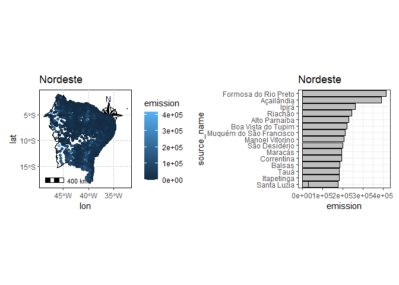
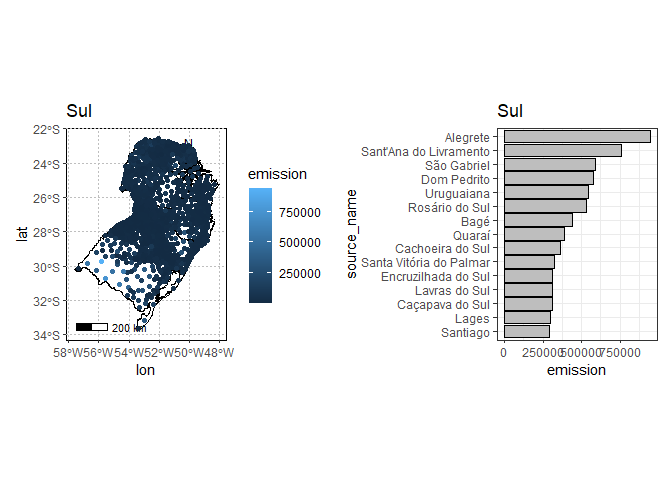
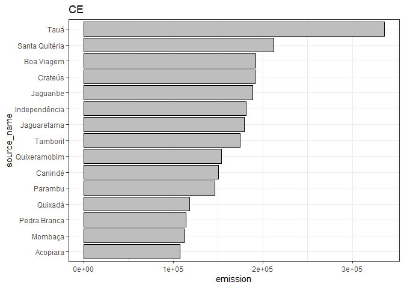
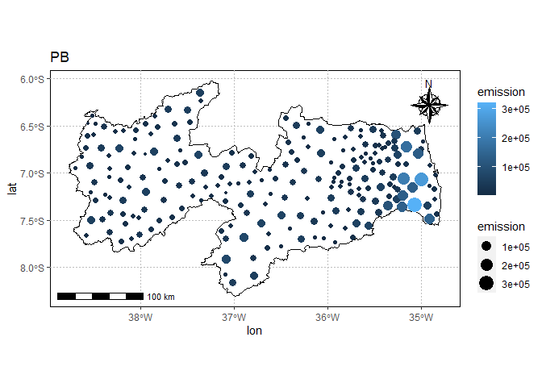
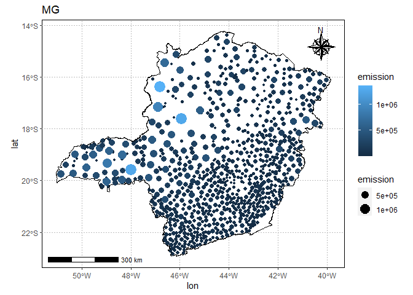

<!-- README.md is generated from README.Rmd. Please edit that file -->

# climate-trace-br

## Aquisição dos dados

  

 \## Carregando Pacotes

``` r
library(tidyverse)
library(geobr)
source("R/gafico.R")
```

## Mesclando base com ids

### Carregando as bases de dados

``` r
emissions_sources <- read_rds("data/emissions_sources.rds")
states <- read_rds("data/states.rds")
brazil_ids <- read_rds("data/df_nome.rds")
glimpse(brazil_ids)
#> Rows: 5,570
#> Columns: 25
#> $ id_municipio              <chr> "1100338", "1100205", "1101104", "1100809", …
#> $ id_municipio_6            <chr> "110033", "110020", "110110", "110080", "110…
#> $ id_municipio_tse          <chr> "434", "35", "493", "477", "680", "779", "67…
#> $ id_municipio_rf           <chr> "47", "3", "683", "681", "8", "4", "679", "1…
#> $ id_municipio_bcb          <chr> "44516", "30719", "46851", "46961", "56652",…
#> $ nome                      <chr> "Nova Mamoré", "Porto Velho", "Itapuã do Oes…
#> $ capital_uf                <int> 0, 1, 0, 0, 0, 0, 0, 0, 0, 0, 0, 0, 0, 0, 0,…
#> $ id_comarca                <chr> "1100106", "1100205", "1100205", "1100205", …
#> $ id_regiao_saude           <chr> "11004", "11004", "11004", "11004", "11001",…
#> $ nome_regiao_saude         <chr> "Madeira-Mamoré", "Madeira-Mamoré", "Madeira…
#> $ id_regiao_imediata        <chr> "110001", "110001", "110001", "110001", "110…
#> $ nome_regiao_imediata      <chr> "Porto Velho", "Porto Velho", "Porto Velho",…
#> $ id_regiao_intermediaria   <chr> "1101", "1101", "1101", "1101", "1101", "110…
#> $ nome_regiao_intermediaria <chr> "Porto Velho", "Porto Velho", "Porto Velho",…
#> $ id_microrregiao           <chr> "11001", "11001", "11001", "11001", "11001",…
#> $ nome_microrregiao         <chr> "Porto Velho", "Porto Velho", "Porto Velho",…
#> $ id_mesorregiao            <chr> "1101", "1101", "1101", "1101", "1101", "110…
#> $ nome_mesorregiao          <chr> "Madeira-Guaporé", "Madeira-Guaporé", "Madei…
#> $ id_regiao_metropolitana   <chr> NA, "101", NA, "101", NA, NA, NA, NA, NA, NA…
#> $ nome_regiao_metropolitana <chr> NA, "Região Metropolitana de Porto Velho", N…
#> $ ddd                       <chr> "69", "69", "69", "69", "69", "69", "69", "6…
#> $ id_uf                     <chr> "11", "11", "11", "11", "11", "11", "11", "1…
#> $ sigla_uf                  <chr> "RO", "RO", "RO", "RO", "RO", "RO", "RO", "R…
#> $ nome_uf                   <chr> "Rondônia", "Rondônia", "Rondônia", "Rondôni…
#> $ nome_regiao               <chr> "Norte", "Norte", "Norte", "Norte", "Norte",…
nomes_uf <- c(brazil_ids$nome_uf %>% unique(),"Brazil")
abbrev_states <- brazil_ids$sigla_uf %>% unique()
```

### Lendo o polígono dos estados

``` r
states  %>%
  ggplot() +
  geom_sf(fill="white", color="black",
          size=.15, show.legend = FALSE) +
  geom_point(
    data = emissions_sources %>%
      filter(sigla_uf %in% c("AC","AM","PA","AP","RR","RO","TO"),
             year == 2020
             ),
    aes(lon,lat)) +
  tema_mapa()
```

<!-- -->

``` r
emissions_sources %>% 
  filter(sigla_uf == "AC",
         year == 2022,
         gas == "co2e_100yr",
         sector_name == "forestry",
         source_name != "Acre") %>% 
  group_by(sub_sector) %>% 
  arrange(emissions_quantity %>% desc()) %>% #select(source_name, emissions_quantity)
  summarise(
    emission = sum(emissions_quantity, na.rm = TRUE)
  ) %>% 
#  filter(str_detect(sub_sector,"^n")) %>% 
  mutate(
    emission_cumulatice = cumsum(emission)
  )
#> # A tibble: 9 × 3
#>   sub_sector                emission emission_cumulatice
#>   <chr>                        <dbl>               <dbl>
#> 1 forest-land-clearing     70906521.           70906521.
#> 2 forest-land-degradation   5664018.           76570539.
#> 3 forest-land-fires        11514212.           88084751.
#> 4 net-forest-land         -11603290.           76481461.
#> 5 net-shrubgrass           -1279601.           75201860.
#> 6 net-wetland                 -3499.           75198360.
#> 7 removals                -88142790.          -12944430.
#> 8 shrubgrass-fires           152575.          -12791855.
#> 9 wetland-fires                1511.          -12790344.
```

``` r
states  %>%
  ggplot() +
  geom_sf(fill="white", color="black",
          size=.15, show.legend = FALSE) +
  geom_point(
    data = emissions_sources %>% 
  filter(sigla_uf == "SP",
         year == 2022,
         gas == "co2e_100yr",
         sector_name == "agriculture",
         source_name != "São Paulo") %>% 
    group_by(sector_name,lat,lon) %>% 
    summarise(
      emission = sum(emissions_quantity)
    ),
    aes(lon,lat,color=emission)) +
  tema_mapa()
```

<!-- -->

``` r
abbrev_states 
#>  [1] "RO" "AC" "AM" "RR" "PA" "AP" "TO" "MA" "PI" "CE" "RN" "PB" "PE" "AL" "SE"
#> [16] "BA" "MG" "ES" "RJ" "SP" "PR" "SC" "RS" "MS" "MT" "GO" "DF"
for(i in seq_along(abbrev_states[-27])){
  my_state <- abbrev_states[i]
  my_plot <- states %>%
    filter(abbrev_state == my_state) %>% 
    ggplot() +
    geom_sf(fill="white", color="black",
            size=.15, show.legend = FALSE) +
    tema_mapa() +
    geom_point(data = emissions_sources %>% 
                 filter(sigla_uf == my_state,
                        year == 2022,
                        gas == "co2e_100yr",
                        sector_name == "agriculture",
                        !source_name %in% nomes_uf) %>% 
                 group_by(source_name,lat,lon) %>% 
                 summarise(
                   emission = sum(emissions_quantity)
                 ) %>% 
                 ungroup(), 
               aes(lon, lat, size = emission, color=emission))+
    labs(title = my_state)
  
  my_col <- emissions_sources %>% 
    filter(sigla_uf == my_state,
           year == 2022,
           gas == "co2e_100yr",
           sector_name == "agriculture",
           !source_name %in% nomes_uf) %>% 
    group_by(source_name,lat,lon) %>% 
    summarise(
      emission = sum(emissions_quantity),
    ) %>% 
    ungroup() %>% 
    filter(emission > quantile(emission,.75)) %>% 
    mutate(
      perc = emission/sum(emission),
      source_name = source_name %>% fct_lump(n=15,w=perc) %>%
        fct_reorder(emission)) %>%
    filter(source_name != "Other") %>% 
    ggplot(aes(x=source_name, y= emission))+
    geom_col(fill="gray",color="black") +
    coord_flip() +
    theme_bw() +
    labs(title = my_state)    
  print(my_plot)
  print(my_col)
}
```

<!-- --><!-- --><!-- --><!-- --><!-- --><!-- --><!-- --><!-- --><!-- --><!-- --><!-- --><!-- --><!-- --><!-- --><!-- --><!-- --><!-- --><!-- --><!-- --><!-- --><!-- --><!-- --><!-- --><!-- --><!-- --><!-- --><!-- --><!-- --><!-- --><!-- --><!-- --><!-- --><!-- --><!-- --><!-- --><!-- --><!-- --><!-- --><!-- --><!-- --><!-- --><!-- --><!-- --><!-- --><!-- --><!-- --><!-- --><!-- --><!-- --><!-- --><!-- --><!-- -->
