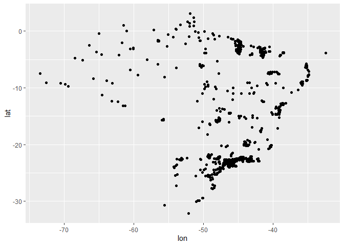
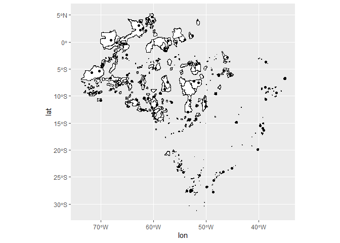
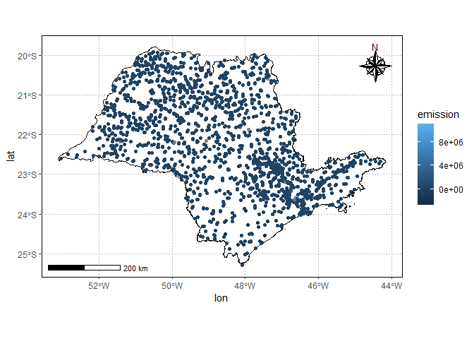
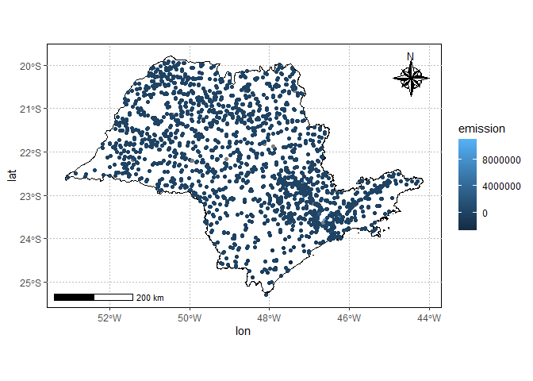
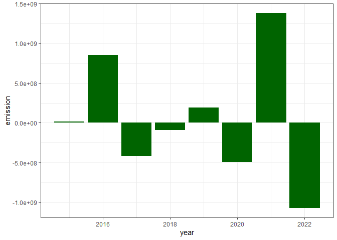
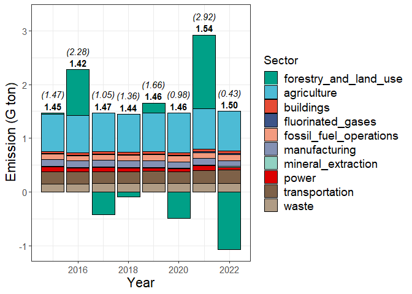

<!-- README.md is generated from README.Rmd. Please edit that file -->

# climate-trace-br

## Aquisição dos dados

  

 \## Carregando Pacotes

``` r
library(tidyverse)
library(ggsci)
library(geobr)
source("R/gafico.R")
source("R/my-function.R")
#>   |                                                                              |                                                                      |   0%  |                                                                              |===                                                                   |   4%  |                                                                              |=====                                                                 |   7%  |                                                                              |========                                                              |  11%  |                                                                              |==========                                                            |  15%  |                                                                              |=============                                                         |  19%  |                                                                              |================                                                      |  22%  |                                                                              |==================                                                    |  26%  |                                                                              |=====================                                                 |  30%  |                                                                              |=======================                                               |  33%  |                                                                              |==========================                                            |  37%  |                                                                              |=============================                                         |  41%  |                                                                              |===============================                                       |  44%  |                                                                              |==================================                                    |  48%  |                                                                              |====================================                                  |  52%  |                                                                              |=======================================                               |  56%  |                                                                              |=========================================                             |  59%  |                                                                              |============================================                          |  63%  |                                                                              |===============================================                       |  67%  |                                                                              |=================================================                     |  70%  |                                                                              |====================================================                  |  74%  |                                                                              |======================================================                |  78%  |                                                                              |=========================================================             |  81%  |                                                                              |============================================================          |  85%  |                                                                              |==============================================================        |  89%  |                                                                              |=================================================================     |  93%  |                                                                              |===================================================================   |  96%  |                                                                              |======================================================================| 100%
#> Downloading: 2 kB     Downloading: 2 kB     Downloading: 2.1 kB     Downloading: 2.1 kB     Downloading: 10 kB     Downloading: 10 kB     Downloading: 26 kB     Downloading: 26 kB     Downloading: 35 kB     Downloading: 35 kB     Downloading: 43 kB     Downloading: 43 kB     Downloading: 59 kB     Downloading: 59 kB     Downloading: 59 kB     Downloading: 59 kB     Downloading: 67 kB     Downloading: 67 kB     Downloading: 75 kB     Downloading: 75 kB     Downloading: 83 kB     Downloading: 83 kB     Downloading: 91 kB     Downloading: 91 kB     Downloading: 99 kB     Downloading: 99 kB     Downloading: 99 kB     Downloading: 99 kB     Downloading: 110 kB     Downloading: 110 kB     Downloading: 110 kB     Downloading: 110 kB     Downloading: 120 kB     Downloading: 120 kB     Downloading: 120 kB     Downloading: 120 kB     Downloading: 130 kB     Downloading: 130 kB     Downloading: 150 kB     Downloading: 150 kB     Downloading: 160 kB     Downloading: 160 kB     Downloading: 160 kB     Downloading: 160 kB     Downloading: 170 kB     Downloading: 170 kB     Downloading: 170 kB     Downloading: 170 kB     Downloading: 180 kB     Downloading: 180 kB     Downloading: 180 kB     Downloading: 180 kB     Downloading: 230 kB     Downloading: 230 kB     Downloading: 240 kB     Downloading: 240 kB     Downloading: 240 kB     Downloading: 240 kB     Downloading: 240 kB     Downloading: 240 kB     Downloading: 250 kB     Downloading: 250 kB     Downloading: 250 kB     Downloading: 250 kB     Downloading: 250 kB     Downloading: 250 kB     Downloading: 250 kB     Downloading: 250 kB     Downloading: 260 kB     Downloading: 260 kB     Downloading: 260 kB     Downloading: 260 kB     Downloading: 270 kB     Downloading: 270 kB     Downloading: 270 kB     Downloading: 270 kB     Downloading: 280 kB     Downloading: 280 kB     Downloading: 290 kB     Downloading: 290 kB     Downloading: 290 kB     Downloading: 290 kB     Downloading: 290 kB     Downloading: 290 kB     Downloading: 300 kB     Downloading: 300 kB     Downloading: 300 kB     Downloading: 300 kB     Downloading: 320 kB     Downloading: 320 kB     Downloading: 330 kB     Downloading: 330 kB     Downloading: 380 kB     Downloading: 380 kB     Downloading: 380 kB     Downloading: 380 kB     Downloading: 400 kB     Downloading: 400 kB     Downloading: 400 kB     Downloading: 400 kB     Downloading: 410 kB     Downloading: 410 kB     Downloading: 420 kB     Downloading: 420 kB     Downloading: 420 kB     Downloading: 420 kB     Downloading: 430 kB     Downloading: 430 kB     Downloading: 440 kB     Downloading: 440 kB     Downloading: 450 kB     Downloading: 450 kB     Downloading: 450 kB     Downloading: 450 kB     Downloading: 460 kB     Downloading: 460 kB     Downloading: 460 kB     Downloading: 460 kB     Downloading: 490 kB     Downloading: 490 kB     Downloading: 490 kB     Downloading: 490 kB     Downloading: 500 kB     Downloading: 500 kB     Downloading: 500 kB     Downloading: 500 kB     Downloading: 500 kB     Downloading: 500 kB     Downloading: 510 kB     Downloading: 510 kB     Downloading: 510 kB     Downloading: 510 kB     Downloading: 530 kB     Downloading: 530 kB     Downloading: 530 kB     Downloading: 530 kB     Downloading: 530 kB     Downloading: 530 kB     Downloading: 540 kB     Downloading: 540 kB     Downloading: 540 kB     Downloading: 540 kB     Downloading: 550 kB     Downloading: 550 kB     Downloading: 550 kB     Downloading: 550 kB     Downloading: 570 kB     Downloading: 570 kB     Downloading: 580 kB     Downloading: 580 kB     Downloading: 580 kB     Downloading: 580 kB     Downloading: 590 kB     Downloading: 590 kB     Downloading: 590 kB     Downloading: 590 kB     Downloading: 610 kB     Downloading: 610 kB     Downloading: 620 kB     Downloading: 620 kB     Downloading: 630 kB     Downloading: 630 kB     Downloading: 650 kB     Downloading: 650 kB     Downloading: 650 kB     Downloading: 650 kB     Downloading: 650 kB     Downloading: 650 kB     Downloading: 660 kB     Downloading: 660 kB     Downloading: 670 kB     Downloading: 670 kB     Downloading: 670 kB     Downloading: 670 kB     Downloading: 670 kB     Downloading: 670 kB     Downloading: 670 kB     Downloading: 670 kB     Downloading: 670 kB     Downloading: 670 kB     Downloading: 690 kB     Downloading: 690 kB     Downloading: 690 kB     Downloading: 690 kB     Downloading: 710 kB     Downloading: 710 kB     Downloading: 710 kB     Downloading: 710 kB     Downloading: 710 kB     Downloading: 710 kB     Downloading: 720 kB     Downloading: 720 kB     Downloading: 730 kB     Downloading: 730 kB     Downloading: 730 kB     Downloading: 730 kB     Downloading: 730 kB     Downloading: 730 kB     Downloading: 750 kB     Downloading: 750 kB     Downloading: 760 kB     Downloading: 760 kB     Downloading: 760 kB     Downloading: 760 kB     Downloading: 770 kB     Downloading: 770 kB     Downloading: 790 kB     Downloading: 790 kB     Downloading: 790 kB     Downloading: 790 kB     Downloading: 790 kB     Downloading: 790 kB     Downloading: 790 kB     Downloading: 790 kB     Downloading: 800 kB     Downloading: 800 kB     Downloading: 800 kB     Downloading: 800 kB     Downloading: 800 kB     Downloading: 800 kB     Downloading: 800 kB     Downloading: 800 kB     Downloading: 810 kB     Downloading: 810 kB     Downloading: 820 kB     Downloading: 820 kB     Downloading: 820 kB     Downloading: 820 kB     Downloading: 830 kB     Downloading: 830 kB     Downloading: 840 kB     Downloading: 840 kB     Downloading: 840 kB     Downloading: 840 kB     Downloading: 840 kB     Downloading: 840 kB     Downloading: 840 kB     Downloading: 840 kB     Downloading: 850 kB     Downloading: 850 kB     Downloading: 850 kB     Downloading: 850 kB     Downloading: 850 kB     Downloading: 850 kB     Downloading: 860 kB     Downloading: 860 kB     Downloading: 860 kB     Downloading: 860 kB     Downloading: 860 kB     Downloading: 860 kB     Downloading: 860 kB     Downloading: 860 kB     Downloading: 870 kB     Downloading: 870 kB     Downloading: 880 kB     Downloading: 880 kB     Downloading: 880 kB     Downloading: 880 kB     Downloading: 880 kB     Downloading: 880 kB     Downloading: 900 kB     Downloading: 900 kB     Downloading: 900 kB     Downloading: 900 kB     Downloading: 910 kB     Downloading: 910 kB     Downloading: 910 kB     Downloading: 910 kB     Downloading: 910 kB     Downloading: 910 kB     Downloading: 920 kB     Downloading: 920 kB     Downloading: 920 kB     Downloading: 920 kB     Downloading: 930 kB     Downloading: 930 kB     Downloading: 930 kB     Downloading: 930 kB     Downloading: 930 kB     Downloading: 930 kB     Downloading: 930 kB     Downloading: 930 kB     Downloading: 930 kB     Downloading: 930 kB     Downloading: 930 kB     Downloading: 930 kB     Downloading: 940 kB     Downloading: 940 kB     Downloading: 940 kB     Downloading: 940 kB     Downloading: 960 kB     Downloading: 960 kB     Downloading: 960 kB     Downloading: 960 kB     Downloading: 960 kB     Downloading: 960 kB     Downloading: 970 kB     Downloading: 970 kB     Downloading: 970 kB     Downloading: 970 kB     Downloading: 980 kB     Downloading: 980 kB     Downloading: 980 kB     Downloading: 980 kB     Downloading: 980 kB     Downloading: 980 kB     Downloading: 990 kB     Downloading: 990 kB     Downloading: 990 kB     Downloading: 990 kB     Downloading: 1,000 kB     Downloading: 1,000 kB     Downloading: 1,000 kB     Downloading: 1,000 kB     Downloading: 1 MB     Downloading: 1 MB     Downloading: 1 MB     Downloading: 1 MB     Downloading: 1 MB     Downloading: 1 MB     Downloading: 1 MB     Downloading: 1 MB     Downloading: 1 MB     Downloading: 1 MB     Downloading: 1 MB     Downloading: 1 MB     Downloading: 1 MB     Downloading: 1 MB     Downloading: 1 MB     Downloading: 1 MB     Downloading: 1 MB     Downloading: 1 MB     Downloading: 1.1 MB     Downloading: 1.1 MB     Downloading: 1.1 MB     Downloading: 1.1 MB     Downloading: 1.1 MB     Downloading: 1.1 MB     Downloading: 1.1 MB     Downloading: 1.1 MB     Downloading: 1.1 MB     Downloading: 1.1 MB     Downloading: 1.1 MB     Downloading: 1.1 MB     Downloading: 1.1 MB     Downloading: 1.1 MB     Downloading: 1.1 MB     Downloading: 1.1 MB     Downloading: 1.1 MB     Downloading: 1.1 MB     Downloading: 1.1 MB     Downloading: 1.1 MB     Downloading: 1.1 MB     Downloading: 1.1 MB     Downloading: 1.1 MB     Downloading: 1.1 MB     Downloading: 1.1 MB     Downloading: 1.1 MB     Downloading: 1.1 MB     Downloading: 1.1 MB     Downloading: 1.1 MB     Downloading: 1.1 MB     Downloading: 1.1 MB     Downloading: 1.1 MB     Downloading: 1.1 MB     Downloading: 1.1 MB     Downloading: 1.1 MB     Downloading: 1.1 MB     Downloading: 1.1 MB     Downloading: 1.1 MB     Downloading: 1.1 MB     Downloading: 1.1 MB     Downloading: 1.2 MB     Downloading: 1.2 MB     Downloading: 1.2 MB     Downloading: 1.2 MB     Downloading: 1.2 MB     Downloading: 1.2 MB     Downloading: 1.2 MB     Downloading: 1.2 MB     Downloading: 1.2 MB     Downloading: 1.2 MB     Downloading: 1.2 MB     Downloading: 1.2 MB     Downloading: 1.2 MB     Downloading: 1.2 MB     Downloading: 1.2 MB     Downloading: 1.2 MB     Downloading: 1.2 MB     Downloading: 1.2 MB     Downloading: 1.2 MB     Downloading: 1.2 MB     Downloading: 1.2 MB     Downloading: 1.2 MB     Downloading: 1.2 MB     Downloading: 1.2 MB     Downloading: 1.2 MB     Downloading: 1.2 MB     Downloading: 1.2 MB     Downloading: 1.2 MB     Downloading: 1.2 MB     Downloading: 1.2 MB     Downloading: 1.2 MB     Downloading: 1.2 MB     Downloading: 1.2 MB     Downloading: 1.2 MB     Downloading: 1.2 MB     Downloading: 1.2 MB     Downloading: 1.2 MB     Downloading: 1.2 MB     Downloading: 1.2 MB     Downloading: 1.2 MB     Downloading: 1.2 MB     Downloading: 1.2 MB     Downloading: 1.2 MB     Downloading: 1.2 MB     Downloading: 1.2 MB     Downloading: 1.2 MB     Downloading: 1.2 MB     Downloading: 1.2 MB     Downloading: 1.3 MB     Downloading: 1.3 MB     Downloading: 1.3 MB     Downloading: 1.3 MB     Downloading: 1.3 MB     Downloading: 1.3 MB     Downloading: 1.3 MB     Downloading: 1.3 MB     Downloading: 1.3 MB     Downloading: 1.3 MB     Downloading: 1.3 MB     Downloading: 1.3 MB     Downloading: 1.3 MB     Downloading: 1.3 MB     Downloading: 1.3 MB     Downloading: 1.3 MB     Downloading: 1.3 MB     Downloading: 1.3 MB     Downloading: 1.3 MB     Downloading: 1.3 MB     Downloading: 1.3 MB     Downloading: 1.3 MB     Downloading: 1.3 MB     Downloading: 1.3 MB     Downloading: 1.3 MB     Downloading: 1.3 MB     Downloading: 1.4 MB     Downloading: 1.4 MB     Downloading: 1.4 MB     Downloading: 1.4 MB     Downloading: 1.4 MB     Downloading: 1.4 MB     Downloading: 1.4 MB     Downloading: 1.4 MB     Downloading: 1.4 MB     Downloading: 1.4 MB     Downloading: 1.4 MB     Downloading: 1.4 MB     Downloading: 1.4 MB     Downloading: 1.4 MB     Downloading: 1.4 MB     Downloading: 1.4 MB     Downloading: 1.4 MB     Downloading: 1.4 MB     Downloading: 1.4 MB     Downloading: 1.4 MB     Downloading: 1.4 MB     Downloading: 1.4 MB     Downloading: 1.4 MB     Downloading: 1.4 MB     Downloading: 1.4 MB     Downloading: 1.4 MB     Downloading: 1.4 MB     Downloading: 1.4 MB     Downloading: 1.4 MB     Downloading: 1.4 MB     Downloading: 1.4 MB     Downloading: 1.4 MB     Downloading: 1.4 MB     Downloading: 1.4 MB     Downloading: 1.5 MB     Downloading: 1.5 MB     Downloading: 1.5 MB     Downloading: 1.5 MB     Downloading: 1.5 MB     Downloading: 1.5 MB     Downloading: 1.5 MB     Downloading: 1.5 MB     Downloading: 1.5 MB     Downloading: 1.5 MB     Downloading: 1.5 MB     Downloading: 1.5 MB     Downloading: 1.5 MB     Downloading: 1.5 MB     Downloading: 1.5 MB     Downloading: 1.5 MB     Downloading: 1.5 MB     Downloading: 1.5 MB     Downloading: 1.5 MB     Downloading: 1.5 MB     Downloading: 1.5 MB     Downloading: 1.5 MB     Downloading: 1.5 MB     Downloading: 1.5 MB     Downloading: 1.6 MB     Downloading: 1.6 MB     Downloading: 1.6 MB     Downloading: 1.6 MB     Downloading: 1.6 MB     Downloading: 1.6 MB     Downloading: 1.6 MB     Downloading: 1.6 MB     Downloading: 1.6 MB     Downloading: 1.6 MB     Downloading: 1.6 MB     Downloading: 1.6 MB     Downloading: 1.6 MB     Downloading: 1.6 MB     Downloading: 1.6 MB     Downloading: 1.6 MB     Downloading: 1.6 MB     Downloading: 1.6 MB     Downloading: 1.6 MB     Downloading: 1.6 MB     Downloading: 1.6 MB     Downloading: 1.6 MB     Downloading: 1.6 MB     Downloading: 1.6 MB     Downloading: 1.7 MB     Downloading: 1.7 MB     Downloading: 1.7 MB     Downloading: 1.7 MB     Downloading: 1.7 MB     Downloading: 1.7 MB     Downloading: 1.7 MB     Downloading: 1.7 MB     Downloading: 1.7 MB     Downloading: 1.7 MB     Downloading: 1.7 MB     Downloading: 1.7 MB     Downloading: 1.7 MB     Downloading: 1.7 MB     Downloading: 1.7 MB     Downloading: 1.7 MB     Downloading: 1.7 MB     Downloading: 1.7 MB     Downloading: 1.7 MB     Downloading: 1.7 MB     Downloading: 1.7 MB     Downloading: 1.7 MB     Downloading: 1.7 MB     Downloading: 1.7 MB     Downloading: 1.7 MB     Downloading: 1.7 MB     Downloading: 1.7 MB     Downloading: 1.7 MB     Downloading: 1.7 MB     Downloading: 1.7 MB     Downloading: 1.7 MB     Downloading: 1.7 MB     Downloading: 1.7 MB     Downloading: 1.7 MB     Downloading: 1.8 MB     Downloading: 1.8 MB     Downloading: 1.8 MB     Downloading: 1.8 MB     Downloading: 1.8 MB     Downloading: 1.8 MB     Downloading: 1.8 MB     Downloading: 1.8 MB     Downloading: 1.8 MB     Downloading: 1.8 MB     Downloading: 1.8 MB     Downloading: 1.8 MB     Downloading: 1.8 MB     Downloading: 1.8 MB     Downloading: 1.8 MB     Downloading: 1.8 MB     Downloading: 1.8 MB     Downloading: 1.8 MB     Downloading: 1.8 MB     Downloading: 1.8 MB     Downloading: 1.8 MB     Downloading: 1.8 MB     Downloading: 1.8 MB     Downloading: 1.8 MB     Downloading: 1.8 MB     Downloading: 1.8 MB     Downloading: 1.8 MB     Downloading: 1.8 MB     Downloading: 1.8 MB     Downloading: 1.8 MB     Downloading: 1.8 MB     Downloading: 1.8 MB     Downloading: 1.8 MB     Downloading: 1.8 MB     Downloading: 1.8 MB     Downloading: 1.8 MB     Downloading: 1.9 MB     Downloading: 1.9 MB     Downloading: 1.9 MB     Downloading: 1.9 MB     Downloading: 1.9 MB     Downloading: 1.9 MB     Downloading: 1.9 MB     Downloading: 1.9 MB     Downloading: 1.9 MB     Downloading: 1.9 MB     Downloading: 1.9 MB     Downloading: 1.9 MB     Downloading: 2 MB     Downloading: 2 MB     Downloading: 2 MB     Downloading: 2 MB     Downloading: 2 MB     Downloading: 2 MB     Downloading: 2 MB     Downloading: 2 MB     Downloading: 2 MB     Downloading: 2 MB     Downloading: 2 MB     Downloading: 2 MB     Downloading: 2 MB     Downloading: 2 MB     Downloading: 2 MB     Downloading: 2 MB     Downloading: 2 MB     Downloading: 2 MB     Downloading: 2 MB     Downloading: 2 MB     Downloading: 2 MB     Downloading: 2 MB     Downloading: 2 MB     Downloading: 2 MB     Downloading: 2 MB     Downloading: 2 MB     Downloading: 2.1 MB     Downloading: 2.1 MB     Downloading: 2.1 MB     Downloading: 2.1 MB     Downloading: 2.1 MB     Downloading: 2.1 MB     Downloading: 2.1 MB     Downloading: 2.1 MB     Downloading: 2.1 MB     Downloading: 2.1 MB     Downloading: 2.1 MB     Downloading: 2.1 MB     Downloading: 2.1 MB     Downloading: 2.1 MB     Downloading: 2.1 MB     Downloading: 2.1 MB     Downloading: 2.1 MB     Downloading: 2.1 MB     Downloading: 2.1 MB     Downloading: 2.1 MB     Downloading: 2.1 MB     Downloading: 2.1 MB     Downloading: 2.1 MB     Downloading: 2.1 MB     Downloading: 2.1 MB     Downloading: 2.1 MB     Downloading: 2.1 MB     Downloading: 2.1 MB     Downloading: 2.1 MB     Downloading: 2.1 MB     Downloading: 2.1 MB     Downloading: 2.1 MB     Downloading: 2.1 MB     Downloading: 2.1 MB     Downloading: 2.1 MB     Downloading: 2.1 MB     Downloading: 2.1 MB     Downloading: 2.1 MB     Downloading: 2.1 MB     Downloading: 2.1 MB     Downloading: 2.1 MB     Downloading: 2.1 MB     Downloading: 2.1 MB     Downloading: 2.1 MB     Downloading: 2.2 MB     Downloading: 2.2 MB     Downloading: 2.2 MB     Downloading: 2.2 MB     Downloading: 2.2 MB     Downloading: 2.2 MB     Downloading: 2.2 MB     Downloading: 2.2 MB     Downloading: 2.2 MB     Downloading: 2.2 MB     Downloading: 2.2 MB     Downloading: 2.2 MB     Downloading: 2.2 MB     Downloading: 2.2 MB     Downloading: 2.2 MB     Downloading: 2.2 MB     Downloading: 2.2 MB     Downloading: 2.2 MB     Downloading: 2.2 MB     Downloading: 2.2 MB     Downloading: 2.2 MB     Downloading: 2.2 MB     Downloading: 2.2 MB     Downloading: 2.2 MB     Downloading: 2.2 MB     Downloading: 2.2 MB     Downloading: 2.2 MB     Downloading: 2.2 MB     Downloading: 2.2 MB     Downloading: 2.2 MB     Downloading: 2.2 MB     Downloading: 2.2 MB     Downloading: 2.2 MB     Downloading: 2.2 MB     Downloading: 2.2 MB     Downloading: 2.2 MB     Downloading: 2.2 MB     Downloading: 2.2 MB     Downloading: 2.2 MB     Downloading: 2.2 MB     Downloading: 2.2 MB     Downloading: 2.2 MB     Downloading: 2.2 MB     Downloading: 2.2 MB     Downloading: 2.2 MB     Downloading: 2.2 MB     Downloading: 2.2 MB     Downloading: 2.2 MB     Downloading: 2.2 MB     Downloading: 2.2 MB     Downloading: 2.3 MB     Downloading: 2.3 MB     Downloading: 2.3 MB     Downloading: 2.3 MB     Downloading: 2.3 MB     Downloading: 2.3 MB     Downloading: 2.3 MB     Downloading: 2.3 MB     Downloading: 2.3 MB     Downloading: 2.3 MB     Downloading: 2.3 MB     Downloading: 2.3 MB     Downloading: 2.3 MB     Downloading: 2.3 MB     Downloading: 2.3 MB     Downloading: 2.3 MB     Downloading: 2.3 MB     Downloading: 2.3 MB     Downloading: 2.3 MB     Downloading: 2.3 MB     Downloading: 2.3 MB     Downloading: 2.3 MB     Downloading: 2.3 MB     Downloading: 2.3 MB     Downloading: 2.3 MB     Downloading: 2.3 MB     Downloading: 2.3 MB     Downloading: 2.3 MB     Downloading: 2.3 MB     Downloading: 2.3 MB     Downloading: 2.3 MB     Downloading: 2.3 MB     Downloading: 2.3 MB     Downloading: 2.3 MB     Downloading: 2.3 MB     Downloading: 2.3 MB     Downloading: 2.3 MB     Downloading: 2.3 MB     Downloading: 2.3 MB     Downloading: 2.3 MB     Downloading: 2.3 MB     Downloading: 2.3 MB     Downloading: 2.3 MB     Downloading: 2.3 MB     Downloading: 2.3 MB     Downloading: 2.3 MB     Downloading: 2.3 MB     Downloading: 2.3 MB     Downloading: 2.3 MB     Downloading: 2.3 MB     Downloading: 2.3 MB     Downloading: 2.3 MB     Downloading: 2.3 MB     Downloading: 2.3 MB     Downloading: 2.3 MB     Downloading: 2.3 MB     Downloading: 2.4 MB     Downloading: 2.4 MB     Downloading: 2.4 MB     Downloading: 2.4 MB     Downloading: 2.4 MB     Downloading: 2.4 MB     Downloading: 2.4 MB     Downloading: 2.4 MB     Downloading: 2.4 MB     Downloading: 2.4 MB     Downloading: 2.4 MB     Downloading: 2.4 MB     Downloading: 2.4 MB     Downloading: 2.4 MB     Downloading: 2.4 MB     Downloading: 2.4 MB     Downloading: 2.5 MB     Downloading: 2.5 MB     Downloading: 2.5 MB     Downloading: 2.5 MB     Downloading: 2.5 MB     Downloading: 2.5 MB     Downloading: 2.5 MB     Downloading: 2.5 MB     Downloading: 2.5 MB     Downloading: 2.5 MB     Downloading: 2.5 MB     Downloading: 2.5 MB     Downloading: 2.5 MB     Downloading: 2.5 MB     Downloading: 2.5 MB     Downloading: 2.5 MB     Downloading: 2.5 MB     Downloading: 2.5 MB     Downloading: 2.5 MB     Downloading: 2.5 MB     Downloading: 2.5 MB     Downloading: 2.5 MB     Downloading: 2.5 MB     Downloading: 2.5 MB     Downloading: 2.5 MB     Downloading: 2.5 MB     Downloading: 2.5 MB     Downloading: 2.5 MB     Downloading: 2.5 MB     Downloading: 2.5 MB     Downloading: 2.6 MB     Downloading: 2.6 MB     Downloading: 2.6 MB     Downloading: 2.6 MB     Downloading: 2.6 MB     Downloading: 2.6 MB     Downloading: 2.6 MB     Downloading: 2.6 MB     Downloading: 2.6 MB     Downloading: 2.6 MB     Downloading: 2.6 MB     Downloading: 2.6 MB     Downloading: 2.6 MB     Downloading: 2.6 MB     Downloading: 2.6 MB     Downloading: 2.6 MB     Downloading: 2.6 MB     Downloading: 2.6 MB     Downloading: 2.6 MB     Downloading: 2.6 MB     Downloading: 2.6 MB     Downloading: 2.6 MB     Downloading: 2.6 MB     Downloading: 2.6 MB     Downloading: 2.6 MB     Downloading: 2.6 MB     Downloading: 2.6 MB     Downloading: 2.6 MB     Downloading: 2.6 MB     Downloading: 2.6 MB     Downloading: 2.6 MB     Downloading: 2.6 MB     Downloading: 2.6 MB     Downloading: 2.6 MB     Downloading: 2.6 MB     Downloading: 2.6 MB     Downloading: 2.6 MB     Downloading: 2.6 MB     Downloading: 2.7 MB     Downloading: 2.7 MB     Downloading: 2.7 MB     Downloading: 2.7 MB     Downloading: 780 B     Downloading: 780 B     Downloading: 2 kB     Downloading: 2 kB     Downloading: 2 kB     Downloading: 2 kB     Downloading: 26 kB     Downloading: 26 kB     Downloading: 34 kB     Downloading: 34 kB     Downloading: 34 kB     Downloading: 34 kB     Downloading: 34 kB     Downloading: 34 kB     Downloading: 59 kB     Downloading: 59 kB     Downloading: 67 kB     Downloading: 67 kB     Downloading: 67 kB     Downloading: 67 kB     Downloading: 75 kB     Downloading: 75 kB     Downloading: 83 kB     Downloading: 83 kB     Downloading: 110 kB     Downloading: 110 kB     Downloading: 110 kB     Downloading: 110 kB     Downloading: 110 kB     Downloading: 110 kB     Downloading: 120 kB     Downloading: 120 kB     Downloading: 130 kB     Downloading: 130 kB     Downloading: 150 kB     Downloading: 150 kB     Downloading: 150 kB     Downloading: 150 kB     Downloading: 150 kB     Downloading: 150 kB     Downloading: 160 kB     Downloading: 160 kB     Downloading: 180 kB     Downloading: 180 kB     Downloading: 190 kB     Downloading: 190 kB     Downloading: 190 kB     Downloading: 190 kB     Downloading: 190 kB     Downloading: 190 kB     Downloading: 190 kB     Downloading: 190 kB     Downloading: 200 kB     Downloading: 200 kB     Downloading: 230 kB     Downloading: 230 kB     Downloading: 230 kB     Downloading: 230 kB     Downloading: 230 kB     Downloading: 230 kB     Downloading: 230 kB     Downloading: 230 kB     Downloading: 240 kB     Downloading: 240 kB     Downloading: 270 kB     Downloading: 270 kB     Downloading: 270 kB     Downloading: 270 kB     Downloading: 270 kB     Downloading: 270 kB     Downloading: 270 kB     Downloading: 270 kB     Downloading: 280 kB     Downloading: 280 kB     Downloading: 310 kB     Downloading: 310 kB     Downloading: 310 kB     Downloading: 310 kB     Downloading: 310 kB     Downloading: 310 kB     Downloading: 320 kB     Downloading: 320 kB     Downloading: 330 kB     Downloading: 330 kB     Downloading: 340 kB     Downloading: 340 kB     Downloading: 350 kB     Downloading: 350 kB     Downloading: 360 kB     Downloading: 360 kB     Downloading: 360 kB     Downloading: 360 kB     Downloading: 370 kB     Downloading: 370 kB     Downloading: 390 kB     Downloading: 390 kB     Downloading: 400 kB     Downloading: 400 kB     Downloading: 400 kB     Downloading: 400 kB     Downloading: 430 kB     Downloading: 430 kB     Downloading: 430 kB     Downloading: 430 kB     Downloading: 440 kB     Downloading: 440 kB     Downloading: 450 kB     Downloading: 450 kB     Downloading: 450 kB     Downloading: 450 kB     Downloading: 470 kB     Downloading: 470 kB     Downloading: 490 kB     Downloading: 490 kB     Downloading: 490 kB     Downloading: 490 kB     Downloading: 490 kB     Downloading: 490 kB     Downloading: 500 kB     Downloading: 500 kB     Downloading: 500 kB     Downloading: 500 kB     Downloading: 530 kB     Downloading: 530 kB     Downloading: 540 kB     Downloading: 540 kB     Downloading: 580 kB     Downloading: 580 kB     Downloading: 580 kB     Downloading: 580 kB     Downloading: 580 kB     Downloading: 580 kB     Downloading: 600 kB     Downloading: 600 kB     Downloading: 630 kB     Downloading: 630 kB     Downloading: 630 kB     Downloading: 630 kB     Downloading: 630 kB     Downloading: 630 kB     Downloading: 630 kB     Downloading: 630 kB     Downloading: 630 kB     Downloading: 630 kB     Downloading: 660 kB     Downloading: 660 kB     Downloading: 670 kB     Downloading: 670 kB     Downloading: 670 kB     Downloading: 670 kB     Downloading: 680 kB     Downloading: 680 kB     Downloading: 680 kB     Downloading: 680 kB     Downloading: 680 kB     Downloading: 680 kB     Downloading: 700 kB     Downloading: 700 kB     Downloading: 710 kB     Downloading: 710 kB     Downloading: 720 kB     Downloading: 720 kB     Downloading: 730 kB     Downloading: 730 kB     Downloading: 730 kB     Downloading: 730 kB     Downloading: 730 kB     Downloading: 730 kB     Downloading: 750 kB     Downloading: 750 kB     Downloading: 780 kB     Downloading: 780 kB     Downloading: 780 kB     Downloading: 780 kB     Downloading: 800 kB     Downloading: 800 kB     Downloading: 830 kB     Downloading: 830 kB     Downloading: 830 kB     Downloading: 830 kB     Downloading: 840 kB     Downloading: 840 kB     Downloading: 840 kB     Downloading: 840 kB     Downloading: 840 kB     Downloading: 840 kB     Downloading: 870 kB     Downloading: 870 kB     Downloading: 880 kB     Downloading: 880 kB     Downloading: 880 kB     Downloading: 880 kB     Downloading: 890 kB     Downloading: 890 kB     Downloading: 900 kB     Downloading: 900 kB     Downloading: 900 kB     Downloading: 900 kB     Downloading: 920 kB     Downloading: 920 kB     Downloading: 930 kB     Downloading: 930 kB     Downloading: 930 kB     Downloading: 930 kB     Downloading: 950 kB     Downloading: 950 kB     Downloading: 960 kB     Downloading: 960 kB     Downloading: 980 kB     Downloading: 980 kB     Downloading: 990 kB     Downloading: 990 kB     Downloading: 990 kB     Downloading: 990 kB     Downloading: 1.1 MB     Downloading: 1.1 MB     Downloading: 1.1 MB     Downloading: 1.1 MB     Downloading: 1.1 MB     Downloading: 1.1 MB     Downloading: 1.1 MB     Downloading: 1.1 MB     Downloading: 1.1 MB     Downloading: 1.1 MB     Downloading: 1.1 MB     Downloading: 1.1 MB     Downloading: 1.1 MB     Downloading: 1.1 MB     Downloading: 1.1 MB     Downloading: 1.1 MB     Downloading: 1.1 MB     Downloading: 1.1 MB     Downloading: 1.1 MB     Downloading: 1.1 MB     Downloading: 1.1 MB     Downloading: 1.1 MB     Downloading: 1.1 MB     Downloading: 1.1 MB     Downloading: 1.1 MB     Downloading: 1.1 MB     Downloading: 1.2 MB     Downloading: 1.2 MB     Downloading: 1.2 MB     Downloading: 1.2 MB     Downloading: 1.2 MB     Downloading: 1.2 MB     Downloading: 1.2 MB     Downloading: 1.2 MB     Downloading: 1.2 MB     Downloading: 1.2 MB     Downloading: 1.2 MB     Downloading: 1.2 MB     Downloading: 1.2 MB     Downloading: 1.2 MB     Downloading: 1.2 MB     Downloading: 1.2 MB     Downloading: 1.2 MB     Downloading: 1.2 MB     Downloading: 1.2 MB     Downloading: 1.2 MB     Downloading: 1.2 MB     Downloading: 1.2 MB     Downloading: 1.2 MB     Downloading: 1.2 MB     Downloading: 1.3 MB     Downloading: 1.3 MB     Downloading: 1.3 MB     Downloading: 1.3 MB     Downloading: 1.3 MB     Downloading: 1.3 MB     Downloading: 1.3 MB     Downloading: 1.3 MB     Downloading: 1.3 MB     Downloading: 1.3 MB     Downloading: 1.3 MB     Downloading: 1.3 MB     Downloading: 1.3 MB     Downloading: 1.3 MB     Downloading: 1.3 MB     Downloading: 1.3 MB     Downloading: 1.3 MB     Downloading: 1.3 MB     Downloading: 1.3 MB     Downloading: 1.3 MB     Downloading: 1.3 MB     Downloading: 1.3 MB     Downloading: 1.3 MB     Downloading: 1.3 MB     Downloading: 1.3 MB     Downloading: 1.3 MB     Downloading: 1.3 MB     Downloading: 1.3 MB     Downloading: 1.3 MB     Downloading: 1.3 MB     Downloading: 1.4 MB     Downloading: 1.4 MB     Downloading: 1.4 MB     Downloading: 1.4 MB     Downloading: 1.4 MB     Downloading: 1.4 MB     Downloading: 1.4 MB     Downloading: 1.4 MB     Downloading: 1.4 MB     Downloading: 1.4 MB     Downloading: 1.4 MB     Downloading: 1.4 MB     Downloading: 1.4 MB     Downloading: 1.4 MB     Downloading: 1.4 MB     Downloading: 1.4 MB     Downloading: 1.4 MB     Downloading: 1.4 MB     Downloading: 1.4 MB     Downloading: 1.4 MB     Downloading: 1.4 MB     Downloading: 1.4 MB     Downloading: 1.4 MB     Downloading: 1.4 MB     Downloading: 1.4 MB     Downloading: 1.4 MB     Downloading: 1.5 MB     Downloading: 1.5 MB     Downloading: 1.5 MB     Downloading: 1.5 MB     Downloading: 1.5 MB     Downloading: 1.5 MB     Downloading: 1.5 MB     Downloading: 1.5 MB     Downloading: 1.5 MB     Downloading: 1.5 MB     Downloading: 1.5 MB     Downloading: 1.5 MB     Downloading: 1.5 MB     Downloading: 1.5 MB     Downloading: 1.5 MB     Downloading: 1.5 MB     Downloading: 1.5 MB     Downloading: 1.5 MB     Downloading: 1.5 MB     Downloading: 1.5 MB     Downloading: 1.6 MB     Downloading: 1.6 MB     Downloading: 1.6 MB     Downloading: 1.6 MB     Downloading: 1.6 MB     Downloading: 1.6 MB     Downloading: 1.6 MB     Downloading: 1.6 MB     Downloading: 1.6 MB     Downloading: 1.6 MB     Downloading: 1.6 MB     Downloading: 1.6 MB     Downloading: 1.6 MB     Downloading: 1.6 MB     Downloading: 1.6 MB     Downloading: 1.6 MB     Downloading: 1.6 MB     Downloading: 1.6 MB     Downloading: 1.6 MB     Downloading: 1.6 MB     Downloading: 1.6 MB     Downloading: 1.6 MB     Downloading: 1.6 MB     Downloading: 1.6 MB     Downloading: 1.6 MB     Downloading: 1.6 MB     Downloading: 1.6 MB     Downloading: 1.6 MB     Downloading: 1.7 MB     Downloading: 1.7 MB     Downloading: 1.7 MB     Downloading: 1.7 MB     Downloading: 1.7 MB     Downloading: 1.7 MB     Downloading: 1.7 MB     Downloading: 1.7 MB     Downloading: 1.7 MB     Downloading: 1.7 MB     Downloading: 1.7 MB     Downloading: 1.7 MB     Downloading: 1.7 MB     Downloading: 1.7 MB     Downloading: 1.7 MB     Downloading: 1.7 MB     Downloading: 1.7 MB     Downloading: 1.7 MB     Downloading: 1.7 MB     Downloading: 1.7 MB     Downloading: 1.7 MB     Downloading: 1.7 MB     Downloading: 1.7 MB     Downloading: 1.7 MB     Downloading: 1.7 MB     Downloading: 1.7 MB     Downloading: 1.7 MB     Downloading: 1.7 MB     Downloading: 1.7 MB     Downloading: 1.7 MB     Downloading: 1.7 MB     Downloading: 1.7 MB     Downloading: 1.8 MB     Downloading: 1.8 MB     Downloading: 1.8 MB     Downloading: 1.8 MB     Downloading: 1.8 MB     Downloading: 1.8 MB     Downloading: 1.8 MB     Downloading: 1.8 MB     Downloading: 1.8 MB     Downloading: 1.8 MB     Downloading: 1.8 MB     Downloading: 1.8 MB     Downloading: 1.8 MB     Downloading: 1.8 MB     Downloading: 1.8 MB     Downloading: 1.8 MB     Downloading: 1.8 MB     Downloading: 1.8 MB     Downloading: 1.8 MB     Downloading: 1.8 MB     Downloading: 1.8 MB     Downloading: 1.8 MB     Downloading: 1.8 MB     Downloading: 1.8 MB     Downloading: 1.8 MB     Downloading: 1.8 MB     Downloading: 1.8 MB     Downloading: 1.8 MB     Downloading: 1.8 MB     Downloading: 1.8 MB     Downloading: 1.8 MB     Downloading: 1.8 MB     Downloading: 1.8 MB     Downloading: 1.8 MB     Downloading: 1.8 MB     Downloading: 1.8 MB     Downloading: 1.9 MB     Downloading: 1.9 MB     Downloading: 1.9 MB     Downloading: 1.9 MB     Downloading: 1.9 MB     Downloading: 1.9 MB     Downloading: 1.9 MB     Downloading: 1.9 MB     Downloading: 1.9 MB     Downloading: 1.9 MB     Downloading: 1.9 MB     Downloading: 1.9 MB     Downloading: 1.9 MB     Downloading: 1.9 MB     Downloading: 1.9 MB     Downloading: 1.9 MB     Downloading: 1.9 MB     Downloading: 1.9 MB     Downloading: 1.9 MB     Downloading: 1.9 MB     Downloading: 1.9 MB     Downloading: 1.9 MB     Downloading: 1.9 MB     Downloading: 1.9 MB     Downloading: 1.9 MB     Downloading: 1.9 MB     Downloading: 1.9 MB     Downloading: 1.9 MB     Downloading: 1.9 MB     Downloading: 1.9 MB     Downloading: 1.9 MB     Downloading: 1.9 MB     Downloading: 1.9 MB     Downloading: 1.9 MB     Downloading: 1.9 MB     Downloading: 1.9 MB     Downloading: 2 MB     Downloading: 2 MB     Downloading: 2 MB     Downloading: 2 MB     Downloading: 2 MB     Downloading: 2 MB     Downloading: 2 MB     Downloading: 2 MB     Downloading: 2 MB     Downloading: 2 MB     Downloading: 2 MB     Downloading: 2 MB     Downloading: 2 MB     Downloading: 2 MB     Downloading: 2 MB     Downloading: 2 MB     Downloading: 2 MB     Downloading: 2 MB     Downloading: 2 MB     Downloading: 2 MB     Downloading: 2 MB     Downloading: 2 MB     Downloading: 2 MB     Downloading: 2 MB     Downloading: 2 MB     Downloading: 2 MB     Downloading: 2 MB     Downloading: 2 MB     Downloading: 2.1 MB     Downloading: 2.1 MB     Downloading: 2.1 MB     Downloading: 2.1 MB     Downloading: 2.1 MB     Downloading: 2.1 MB     Downloading: 2.1 MB     Downloading: 2.1 MB     Downloading: 2.1 MB     Downloading: 2.1 MB     Downloading: 2.1 MB     Downloading: 2.1 MB     Downloading: 2.1 MB     Downloading: 2.1 MB     Downloading: 2.1 MB     Downloading: 2.1 MB     Downloading: 2.1 MB     Downloading: 2.1 MB     Downloading: 2.1 MB     Downloading: 2.1 MB     Downloading: 2.1 MB     Downloading: 2.1 MB     Downloading: 2.1 MB     Downloading: 2.1 MB     Downloading: 2.1 MB     Downloading: 2.1 MB     Downloading: 2.1 MB     Downloading: 2.1 MB     Downloading: 2.2 MB     Downloading: 2.2 MB     Downloading: 2.2 MB     Downloading: 2.2 MB     Downloading: 2.2 MB     Downloading: 2.2 MB     Downloading: 2.2 MB     Downloading: 2.2 MB     Downloading: 2.2 MB     Downloading: 2.2 MB     Downloading: 2.2 MB     Downloading: 2.2 MB     Downloading: 2.2 MB     Downloading: 2.2 MB     Downloading: 2.2 MB     Downloading: 2.2 MB     Downloading: 2.2 MB     Downloading: 2.2 MB     Downloading: 2.2 MB     Downloading: 2.2 MB     Downloading: 2.2 MB     Downloading: 2.2 MB     Downloading: 2.2 MB     Downloading: 2.2 MB     Downloading: 2.2 MB     Downloading: 2.2 MB     Downloading: 2.2 MB     Downloading: 2.2 MB     Downloading: 2.2 MB     Downloading: 2.2 MB     Downloading: 2.2 MB     Downloading: 2.2 MB     Downloading: 2.2 MB     Downloading: 2.2 MB     Downloading: 2.2 MB     Downloading: 2.2 MB     Downloading: 2.2 MB     Downloading: 2.2 MB     Downloading: 2.2 MB     Downloading: 2.2 MB     Downloading: 2.2 MB     Downloading: 2.2 MB     Downloading: 2.2 MB     Downloading: 2.2 MB     Downloading: 2.2 MB     Downloading: 2.2 MB     Downloading: 2.2 MB     Downloading: 2.2 MB     Downloading: 2.3 MB     Downloading: 2.3 MB     Downloading: 2.3 MB     Downloading: 2.3 MB     Downloading: 2.3 MB     Downloading: 2.3 MB     Downloading: 2.3 MB     Downloading: 2.3 MB     Downloading: 2.3 MB     Downloading: 2.3 MB     Downloading: 2.3 MB     Downloading: 2.3 MB     Downloading: 2.3 MB     Downloading: 2.3 MB     Downloading: 2.3 MB     Downloading: 2.3 MB     Downloading: 2.3 MB     Downloading: 2.3 MB     Downloading: 2.3 MB     Downloading: 2.3 MB     Downloading: 2.3 MB     Downloading: 2.3 MB     Downloading: 2.3 MB     Downloading: 2.3 MB     Downloading: 2.3 MB     Downloading: 2.3 MB     Downloading: 2.3 MB     Downloading: 2.3 MB     Downloading: 2.3 MB     Downloading: 2.3 MB     Downloading: 2.3 MB     Downloading: 2.3 MB     Downloading: 2.3 MB     Downloading: 2.3 MB     Downloading: 2.3 MB     Downloading: 2.3 MB     Downloading: 2.3 MB     Downloading: 2.3 MB     Downloading: 2.3 MB     Downloading: 2.3 MB     Downloading: 2.4 MB     Downloading: 2.4 MB     Downloading: 2.4 MB     Downloading: 2.4 MB     Downloading: 2.4 MB     Downloading: 2.4 MB     Downloading: 2.4 MB     Downloading: 2.4 MB     Downloading: 2.4 MB     Downloading: 2.4 MB     Downloading: 2.4 MB     Downloading: 2.4 MB     Downloading: 2.4 MB     Downloading: 2.4 MB     Downloading: 2.4 MB     Downloading: 2.4 MB     Downloading: 2.4 MB     Downloading: 2.4 MB     Downloading: 2.4 MB     Downloading: 2.4 MB     Downloading: 2.4 MB     Downloading: 2.4 MB     Downloading: 2.4 MB     Downloading: 2.4 MB     Downloading: 2.4 MB     Downloading: 2.4 MB     Downloading: 2.4 MB     Downloading: 2.4 MB     Downloading: 2.4 MB     Downloading: 2.4 MB     Downloading: 2.4 MB     Downloading: 2.4 MB     Downloading: 2.4 MB     Downloading: 2.4 MB     Downloading: 2.4 MB     Downloading: 2.4 MB     Downloading: 2.4 MB     Downloading: 2.4 MB     Downloading: 2.4 MB     Downloading: 2.4 MB     Downloading: 2.4 MB     Downloading: 2.4 MB     Downloading: 2.4 MB     Downloading: 2.4 MB     Downloading: 2.4 MB     Downloading: 2.4 MB     Downloading: 2.4 MB     Downloading: 2.4 MB     Downloading: 2.4 MB     Downloading: 2.4 MB     Downloading: 2.4 MB     Downloading: 2.4 MB     Downloading: 2.4 MB     Downloading: 2.4 MB     Downloading: 2.4 MB     Downloading: 2.4 MB     Downloading: 2.4 MB     Downloading: 2.4 MB     Downloading: 2.4 MB     Downloading: 2.4 MB     Downloading: 2.5 MB     Downloading: 2.5 MB     Downloading: 2.5 MB     Downloading: 2.5 MB     Downloading: 2.5 MB     Downloading: 2.5 MB     Downloading: 2.5 MB     Downloading: 2.5 MB     Downloading: 2.5 MB     Downloading: 2.5 MB     Downloading: 2.5 MB     Downloading: 2.5 MB     Downloading: 2.5 MB     Downloading: 2.5 MB     Downloading: 2.5 MB     Downloading: 2.5 MB     Downloading: 2.5 MB     Downloading: 2.5 MB     Downloading: 2.5 MB     Downloading: 2.5 MB     Downloading: 2.5 MB     Downloading: 2.5 MB     Downloading: 2.5 MB     Downloading: 2.5 MB     Downloading: 2.5 MB     Downloading: 2.5 MB     Downloading: 2.5 MB     Downloading: 2.5 MB     Downloading: 2.5 MB     Downloading: 2.5 MB     Downloading: 2.5 MB     Downloading: 2.5 MB     Downloading: 2.5 MB     Downloading: 2.5 MB     Downloading: 2.5 MB     Downloading: 2.5 MB     Downloading: 2.5 MB     Downloading: 2.5 MB     Downloading: 2.6 MB     Downloading: 2.6 MB     Downloading: 2.6 MB     Downloading: 2.6 MB     Downloading: 2.6 MB     Downloading: 2.6 MB     Downloading: 2.6 MB     Downloading: 2.6 MB     Downloading: 2.6 MB     Downloading: 2.6 MB     Downloading: 2.6 MB     Downloading: 2.6 MB     Downloading: 2.6 MB     Downloading: 2.6 MB     Downloading: 2.6 MB     Downloading: 2.6 MB     Downloading: 2.6 MB     Downloading: 2.6 MB     Downloading: 2.6 MB     Downloading: 2.6 MB     Downloading: 2.6 MB     Downloading: 2.6 MB     Downloading: 2.6 MB     Downloading: 2.6 MB     Downloading: 2.6 MB     Downloading: 2.6 MB     Downloading: 2.6 MB     Downloading: 2.6 MB     Downloading: 2.6 MB     Downloading: 2.6 MB     Downloading: 2.6 MB     Downloading: 2.6 MB     Downloading: 2.6 MB     Downloading: 2.6 MB     Downloading: 2.6 MB     Downloading: 2.6 MB     Downloading: 2.6 MB     Downloading: 2.6 MB     Downloading: 2.6 MB     Downloading: 2.6 MB     Downloading: 2.7 MB     Downloading: 2.7 MB     Downloading: 2.7 MB     Downloading: 2.7 MB     Downloading: 2.7 MB     Downloading: 2.7 MB     Downloading: 2.7 MB     Downloading: 2.7 MB     Downloading: 2.7 MB     Downloading: 2.7 MB     Downloading: 2.7 MB     Downloading: 2.7 MB     Downloading: 2.7 MB     Downloading: 2.7 MB     Downloading: 2.7 MB     Downloading: 2.7 MB     Downloading: 2.7 MB     Downloading: 2.7 MB     Downloading: 2.7 MB     Downloading: 2.7 MB     Downloading: 2.7 MB     Downloading: 2.7 MB     Downloading: 2.7 MB     Downloading: 2.7 MB     Downloading: 2.7 MB     Downloading: 2.7 MB     Downloading: 2.7 MB     Downloading: 2.7 MB     Downloading: 2.7 MB     Downloading: 2.7 MB     Downloading: 2.7 MB     Downloading: 2.7 MB     Downloading: 2.7 MB     Downloading: 2.7 MB     Downloading: 2.7 MB     Downloading: 2.7 MB     Downloading: 2.7 MB     Downloading: 2.7 MB     Downloading: 2.8 MB     Downloading: 2.8 MB     Downloading: 2.8 MB     Downloading: 2.8 MB     Downloading: 2.8 MB     Downloading: 2.8 MB     Downloading: 2.8 MB     Downloading: 2.8 MB     Downloading: 2.8 MB     Downloading: 2.8 MB     Downloading: 2.8 MB     Downloading: 2.8 MB     Downloading: 2.8 MB     Downloading: 2.8 MB     Downloading: 2.8 MB     Downloading: 2.8 MB     Downloading: 2.8 MB     Downloading: 2.8 MB     Downloading: 2.8 MB     Downloading: 2.8 MB     Downloading: 2.8 MB     Downloading: 2.8 MB     Downloading: 2.8 MB     Downloading: 2.8 MB     Downloading: 2.8 MB     Downloading: 2.8 MB     Downloading: 2.8 MB     Downloading: 2.8 MB     Downloading: 2.9 MB     Downloading: 2.9 MB     Downloading: 2.9 MB     Downloading: 2.9 MB     Downloading: 2.9 MB     Downloading: 2.9 MB     Downloading: 2.9 MB     Downloading: 2.9 MB     Downloading: 2.9 MB     Downloading: 2.9 MB     Downloading: 2.9 MB     Downloading: 2.9 MB     Downloading: 2.9 MB     Downloading: 2.9 MB     Downloading: 2.9 MB     Downloading: 2.9 MB     Downloading: 2.9 MB     Downloading: 2.9 MB     Downloading: 2.9 MB     Downloading: 2.9 MB     Downloading: 2.9 MB     Downloading: 2.9 MB     Downloading: 2.9 MB     Downloading: 2.9 MB     Downloading: 3 MB     Downloading: 3 MB     Downloading: 3 MB     Downloading: 3 MB     Downloading: 3 MB     Downloading: 3 MB     Downloading: 3 MB     Downloading: 3 MB     Downloading: 3 MB     Downloading: 3 MB     Downloading: 3 MB     Downloading: 3 MB     Downloading: 3 MB     Downloading: 3 MB     Downloading: 3 MB     Downloading: 3 MB     Downloading: 3 MB     Downloading: 3 MB     Downloading: 3 MB     Downloading: 3 MB     Downloading: 3 MB     Downloading: 3 MB     Downloading: 3 MB     Downloading: 3 MB     Downloading: 3 MB     Downloading: 3 MB     Downloading: 3.1 MB     Downloading: 3.1 MB     Downloading: 3.1 MB     Downloading: 3.1 MB     Downloading: 3.1 MB     Downloading: 3.1 MB     Downloading: 3.1 MB     Downloading: 3.1 MB     Downloading: 3.1 MB     Downloading: 3.1 MB     Downloading: 3.1 MB     Downloading: 3.1 MB     Downloading: 3.1 MB     Downloading: 3.1 MB     Downloading: 3.1 MB     Downloading: 3.1 MB     Downloading: 3.1 MB     Downloading: 3.1 MB     Downloading: 3.1 MB     Downloading: 3.1 MB     Downloading: 3.1 MB     Downloading: 3.1 MB     Downloading: 3.1 MB     Downloading: 3.1 MB     Downloading: 3.2 MB     Downloading: 3.2 MB     Downloading: 3.2 MB     Downloading: 3.2 MB     Downloading: 3.2 MB     Downloading: 3.2 MB     Downloading: 3.2 MB     Downloading: 3.2 MB     Downloading: 3.2 MB     Downloading: 3.2 MB     Downloading: 3.2 MB     Downloading: 3.2 MB     Downloading: 3.2 MB     Downloading: 3.2 MB     Downloading: 3.2 MB     Downloading: 3.2 MB     Downloading: 3.3 MB     Downloading: 3.3 MB     Downloading: 3.3 MB     Downloading: 3.3 MB     Downloading: 3.3 MB     Downloading: 3.3 MB     Downloading: 3.3 MB     Downloading: 3.3 MB     Downloading: 3.3 MB     Downloading: 3.3 MB     Downloading: 3.3 MB     Downloading: 3.3 MB     Downloading: 3.3 MB     Downloading: 3.3 MB     Downloading: 3.3 MB     Downloading: 3.3 MB     Downloading: 3.3 MB     Downloading: 3.3 MB     Downloading: 3.3 MB     Downloading: 3.3 MB     Downloading: 3.3 MB     Downloading: 3.3 MB     Downloading: 3.4 MB     Downloading: 3.4 MB     Downloading: 3.4 MB     Downloading: 3.4 MB     Downloading: 3.4 MB     Downloading: 3.4 MB     Downloading: 3.4 MB     Downloading: 3.4 MB     Downloading: 3.4 MB     Downloading: 3.4 MB     Downloading: 3.4 MB     Downloading: 3.4 MB     Downloading: 3.4 MB     Downloading: 3.4 MB     Downloading: 3.4 MB     Downloading: 3.4 MB     Downloading: 3.4 MB     Downloading: 3.4 MB     Downloading: 3.4 MB     Downloading: 3.4 MB     Downloading: 3.4 MB     Downloading: 3.4 MB     Downloading: 3.5 MB     Downloading: 3.5 MB     Downloading: 3.5 MB     Downloading: 3.5 MB     Downloading: 3.5 MB     Downloading: 3.5 MB     Downloading: 3.5 MB     Downloading: 3.5 MB     Downloading: 3.5 MB     Downloading: 3.5 MB     Downloading: 3.5 MB     Downloading: 3.5 MB     Downloading: 3.5 MB     Downloading: 3.5 MB     Downloading: 3.5 MB     Downloading: 3.5 MB     Downloading: 3.5 MB     Downloading: 3.5 MB     Downloading: 3.5 MB     Downloading: 3.5 MB     Downloading: 3.5 MB     Downloading: 3.5 MB     Downloading: 3.5 MB     Downloading: 3.5 MB     Downloading: 3.6 MB     Downloading: 3.6 MB     Downloading: 3.6 MB     Downloading: 3.6 MB     Downloading: 3.6 MB     Downloading: 3.6 MB     Downloading: 3.6 MB     Downloading: 3.6 MB     Downloading: 3.6 MB     Downloading: 3.6 MB     Downloading: 3.6 MB     Downloading: 3.6 MB     Downloading: 3.6 MB     Downloading: 3.6 MB     Downloading: 3.6 MB     Downloading: 3.6 MB     Downloading: 3.7 MB     Downloading: 3.7 MB     Downloading: 3.7 MB     Downloading: 3.7 MB     Downloading: 3.7 MB     Downloading: 3.7 MB     Downloading: 3.7 MB     Downloading: 3.7 MB     Downloading: 3.7 MB     Downloading: 3.7 MB     Downloading: 3.7 MB     Downloading: 3.7 MB     Downloading: 3.7 MB     Downloading: 3.7 MB     Downloading: 3.7 MB     Downloading: 3.7 MB     Downloading: 3.8 MB     Downloading: 3.8 MB     Downloading: 3.8 MB     Downloading: 3.8 MB     Downloading: 3.8 MB     Downloading: 3.8 MB     Downloading: 3.8 MB     Downloading: 3.8 MB     Downloading: 3.8 MB     Downloading: 3.8 MB     Downloading: 3.8 MB     Downloading: 3.8 MB     Downloading: 3.8 MB     Downloading: 3.8 MB     Downloading: 3.8 MB     Downloading: 3.8 MB     Downloading: 3.8 MB     Downloading: 3.8 MB     Downloading: 3.8 MB     Downloading: 3.8 MB     Downloading: 3.8 MB     Downloading: 3.8 MB     Downloading: 3.9 MB     Downloading: 3.9 MB     Downloading: 3.9 MB     Downloading: 3.9 MB     Downloading: 3.9 MB     Downloading: 3.9 MB     Downloading: 3.9 MB     Downloading: 3.9 MB     Downloading: 770 B     Downloading: 770 B     Downloading: 2 kB     Downloading: 2 kB     Downloading: 2 kB     Downloading: 2 kB     Downloading: 26 kB     Downloading: 26 kB     Downloading: 26 kB     Downloading: 26 kB     Downloading: 26 kB     Downloading: 26 kB     Downloading: 26 kB     Downloading: 26 kB     Downloading: 51 kB     Downloading: 51 kB     Downloading: 51 kB     Downloading: 51 kB     Downloading: 51 kB     Downloading: 51 kB     Downloading: 51 kB     Downloading: 51 kB     Downloading: 59 kB     Downloading: 59 kB     Downloading: 59 kB     Downloading: 59 kB     Downloading: 83 kB     Downloading: 83 kB     Downloading: 83 kB     Downloading: 83 kB     Downloading: 83 kB     Downloading: 83 kB     Downloading: 83 kB     Downloading: 83 kB     Downloading: 91 kB     Downloading: 91 kB     Downloading: 91 kB     Downloading: 91 kB     Downloading: 110 kB     Downloading: 110 kB     Downloading: 120 kB     Downloading: 120 kB     Downloading: 120 kB     Downloading: 120 kB     Downloading: 120 kB     Downloading: 120 kB     Downloading: 120 kB     Downloading: 120 kB     Downloading: 120 kB     Downloading: 120 kB     Downloading: 120 kB     Downloading: 120 kB     Downloading: 140 kB     Downloading: 140 kB     Downloading: 150 kB     Downloading: 150 kB     Downloading: 150 kB     Downloading: 150 kB     Downloading: 160 kB     Downloading: 160 kB     Downloading: 160 kB     Downloading: 160 kB     Downloading: 170 kB     Downloading: 170 kB     Downloading: 180 kB     Downloading: 180 kB     Downloading: 180 kB     Downloading: 180 kB     Downloading: 180 kB     Downloading: 180 kB     Downloading: 190 kB     Downloading: 190 kB     Downloading: 200 kB     Downloading: 200 kB     Downloading: 210 kB     Downloading: 210 kB     Downloading: 210 kB     Downloading: 210 kB     Downloading: 240 kB     Downloading: 240 kB     Downloading: 240 kB     Downloading: 240 kB     Downloading: 240 kB     Downloading: 240 kB     Downloading: 250 kB     Downloading: 250 kB     Downloading: 260 kB     Downloading: 260 kB     Downloading: 280 kB     Downloading: 280 kB     Downloading: 280 kB     Downloading: 280 kB     Downloading: 280 kB     Downloading: 280 kB     Downloading: 290 kB     Downloading: 290 kB     Downloading: 290 kB     Downloading: 290 kB     Downloading: 290 kB     Downloading: 290 kB     Downloading: 310 kB     Downloading: 310 kB     Downloading: 320 kB     Downloading: 320 kB     Downloading: 320 kB     Downloading: 320 kB     Downloading: 330 kB     Downloading: 330 kB     Downloading: 330 kB     Downloading: 330 kB     Downloading: 350 kB     Downloading: 350 kB     Downloading: 350 kB     Downloading: 350 kB     Downloading: 350 kB     Downloading: 350 kB     Downloading: 360 kB     Downloading: 360 kB     Downloading: 370 kB     Downloading: 370 kB     Downloading: 370 kB     Downloading: 370 kB     Downloading: 380 kB     Downloading: 380 kB     Downloading: 380 kB     Downloading: 380 kB     Downloading: 380 kB     Downloading: 380 kB     Downloading: 390 kB     Downloading: 390 kB     Downloading: 400 kB     Downloading: 400 kB     Downloading: 400 kB     Downloading: 400 kB     Downloading: 410 kB     Downloading: 410 kB     Downloading: 420 kB     Downloading: 420 kB     Downloading: 420 kB     Downloading: 420 kB     Downloading: 420 kB     Downloading: 420 kB     Downloading: 440 kB     Downloading: 440 kB     Downloading: 440 kB     Downloading: 440 kB     Downloading: 460 kB     Downloading: 460 kB     Downloading: 460 kB     Downloading: 460 kB     Downloading: 460 kB     Downloading: 460 kB     Downloading: 460 kB     Downloading: 460 kB     Downloading: 470 kB     Downloading: 470 kB     Downloading: 470 kB     Downloading: 470 kB     Downloading: 500 kB     Downloading: 500 kB     Downloading: 500 kB     Downloading: 500 kB     Downloading: 500 kB     Downloading: 500 kB     Downloading: 500 kB     Downloading: 500 kB     Downloading: 530 kB     Downloading: 530 kB     Downloading: 530 kB     Downloading: 530 kB     Downloading: 540 kB     Downloading: 540 kB     Downloading: 540 kB     Downloading: 540 kB     Downloading: 540 kB     Downloading: 540 kB     Downloading: 550 kB     Downloading: 550 kB     Downloading: 570 kB     Downloading: 570 kB     Downloading: 570 kB     Downloading: 570 kB     Downloading: 570 kB     Downloading: 570 kB     Downloading: 570 kB     Downloading: 570 kB     Downloading: 570 kB     Downloading: 570 kB     Downloading: 580 kB     Downloading: 580 kB     Downloading: 590 kB     Downloading: 590 kB     Downloading: 610 kB     Downloading: 610 kB     Downloading: 610 kB     Downloading: 610 kB     Downloading: 610 kB     Downloading: 610 kB     Downloading: 610 kB     Downloading: 610 kB     Downloading: 610 kB     Downloading: 610 kB     Downloading: 630 kB     Downloading: 630 kB     Downloading: 630 kB     Downloading: 630 kB     Downloading: 650 kB     Downloading: 650 kB     Downloading: 650 kB     Downloading: 650 kB     Downloading: 650 kB     Downloading: 650 kB     Downloading: 650 kB     Downloading: 650 kB     Downloading: 670 kB     Downloading: 670 kB     Downloading: 670 kB     Downloading: 670 kB     Downloading: 690 kB     Downloading: 690 kB     Downloading: 690 kB     Downloading: 690 kB     Downloading: 700 kB     Downloading: 700 kB     Downloading: 710 kB     Downloading: 710 kB     Downloading: 710 kB     Downloading: 710 kB     Downloading: 730 kB     Downloading: 730 kB     Downloading: 730 kB     Downloading: 730 kB     Downloading: 730 kB     Downloading: 730 kB     Downloading: 730 kB     Downloading: 730 kB     Downloading: 740 kB     Downloading: 740 kB     Downloading: 740 kB     Downloading: 740 kB     Downloading: 750 kB     Downloading: 750 kB     Downloading: 750 kB     Downloading: 750 kB     Downloading: 770 kB     Downloading: 770 kB     Downloading: 770 kB     Downloading: 770 kB     Downloading: 780 kB     Downloading: 780 kB     Downloading: 790 kB     Downloading: 790 kB     Downloading: 800 kB     Downloading: 800 kB     Downloading: 800 kB     Downloading: 800 kB     Downloading: 810 kB     Downloading: 810 kB     Downloading: 810 kB     Downloading: 810 kB     Downloading: 820 kB     Downloading: 820 kB     Downloading: 820 kB     Downloading: 820 kB     Downloading: 820 kB     Downloading: 820 kB     Downloading: 820 kB     Downloading: 820 kB     Downloading: 830 kB     Downloading: 830 kB     Downloading: 840 kB     Downloading: 840 kB     Downloading: 840 kB     Downloading: 840 kB     Downloading: 840 kB     Downloading: 840 kB     Downloading: 840 kB     Downloading: 840 kB     Downloading: 860 kB     Downloading: 860 kB     Downloading: 860 kB     Downloading: 860 kB     Downloading: 860 kB     Downloading: 860 kB     Downloading: 870 kB     Downloading: 870 kB     Downloading: 870 kB     Downloading: 870 kB     Downloading: 880 kB     Downloading: 880 kB     Downloading: 880 kB     Downloading: 880 kB     Downloading: 880 kB     Downloading: 880 kB     Downloading: 880 kB     Downloading: 880 kB     Downloading: 890 kB     Downloading: 890 kB     Downloading: 910 kB     Downloading: 910 kB     Downloading: 910 kB     Downloading: 910 kB     Downloading: 910 kB     Downloading: 910 kB     Downloading: 920 kB     Downloading: 920 kB     Downloading: 920 kB     Downloading: 920 kB     Downloading: 920 kB     Downloading: 920 kB     Downloading: 930 kB     Downloading: 930 kB     Downloading: 930 kB     Downloading: 930 kB     Downloading: 950 kB     Downloading: 950 kB     Downloading: 950 kB     Downloading: 950 kB     Downloading: 960 kB     Downloading: 960 kB     Downloading: 960 kB     Downloading: 960 kB     Downloading: 960 kB     Downloading: 960 kB     Downloading: 960 kB     Downloading: 960 kB     Downloading: 970 kB     Downloading: 970 kB     Downloading: 980 kB     Downloading: 980 kB     Downloading: 980 kB     Downloading: 980 kB     Downloading: 1,000 kB     Downloading: 1,000 kB     Downloading: 1,000 kB     Downloading: 1,000 kB     Downloading: 1,000 kB     Downloading: 1,000 kB     Downloading: 1 MB     Downloading: 1 MB     Downloading: 1 MB     Downloading: 1 MB     Downloading: 1 MB     Downloading: 1 MB     Downloading: 1 MB     Downloading: 1 MB     Downloading: 1 MB     Downloading: 1 MB     Downloading: 1 MB     Downloading: 1 MB     Downloading: 1 MB     Downloading: 1 MB     Downloading: 1 MB     Downloading: 1 MB     Downloading: 1 MB     Downloading: 1 MB     Downloading: 1.1 MB     Downloading: 1.1 MB     Downloading: 1.1 MB     Downloading: 1.1 MB     Downloading: 1.1 MB     Downloading: 1.1 MB     Downloading: 1.1 MB     Downloading: 1.1 MB     Downloading: 1.1 MB     Downloading: 1.1 MB     Downloading: 1.1 MB     Downloading: 1.1 MB     Downloading: 1.1 MB     Downloading: 1.1 MB     Downloading: 1.1 MB     Downloading: 1.1 MB     Downloading: 1.1 MB     Downloading: 1.1 MB     Downloading: 1.1 MB     Downloading: 1.1 MB     Downloading: 1.1 MB     Downloading: 1.1 MB     Downloading: 1.1 MB     Downloading: 1.1 MB     Downloading: 1.2 MB     Downloading: 1.2 MB     Downloading: 1.2 MB     Downloading: 1.2 MB     Downloading: 1.2 MB     Downloading: 1.2 MB     Downloading: 1.2 MB     Downloading: 1.2 MB     Downloading: 1.2 MB     Downloading: 1.2 MB     Downloading: 1.2 MB     Downloading: 1.2 MB     Downloading: 1.2 MB     Downloading: 1.2 MB     Downloading: 1.2 MB     Downloading: 1.2 MB     Downloading: 1.2 MB     Downloading: 1.2 MB     Downloading: 1.2 MB     Downloading: 1.2 MB     Downloading: 1.2 MB     Downloading: 1.2 MB     Downloading: 1.3 MB     Downloading: 1.3 MB     Downloading: 1.3 MB     Downloading: 1.3 MB     Downloading: 1.3 MB     Downloading: 1.3 MB     Downloading: 1.3 MB     Downloading: 1.3 MB     Downloading: 1.3 MB     Downloading: 1.3 MB     Downloading: 1.3 MB     Downloading: 1.3 MB     Downloading: 1.3 MB     Downloading: 1.3 MB     Downloading: 1.3 MB     Downloading: 1.3 MB     Downloading: 1.3 MB     Downloading: 1.3 MB     Downloading: 1.3 MB     Downloading: 1.3 MB     Downloading: 1.4 MB     Downloading: 1.4 MB     Downloading: 1.4 MB     Downloading: 1.4 MB     Downloading: 1.4 MB     Downloading: 1.4 MB     Downloading: 1.4 MB     Downloading: 1.4 MB     Downloading: 1.4 MB     Downloading: 1.4 MB     Downloading: 1.4 MB     Downloading: 1.4 MB     Downloading: 1.4 MB     Downloading: 1.4 MB     Downloading: 1.4 MB     Downloading: 1.4 MB     Downloading: 1.4 MB     Downloading: 1.4 MB     Downloading: 1.5 MB     Downloading: 1.5 MB     Downloading: 1.5 MB     Downloading: 1.5 MB     Downloading: 1.5 MB     Downloading: 1.5 MB     Downloading: 1.5 MB     Downloading: 1.5 MB     Downloading: 1.5 MB     Downloading: 1.5 MB     Downloading: 1.5 MB     Downloading: 1.5 MB     Downloading: 1.5 MB     Downloading: 1.5 MB     Downloading: 1.5 MB     Downloading: 1.5 MB     Downloading: 1.5 MB     Downloading: 1.5 MB     Downloading: 1.5 MB     Downloading: 1.5 MB     Downloading: 1.5 MB     Downloading: 1.5 MB     Downloading: 1.5 MB     Downloading: 1.5 MB     Downloading: 1.6 MB     Downloading: 1.6 MB     Downloading: 1.6 MB     Downloading: 1.6 MB     Downloading: 1.6 MB     Downloading: 1.6 MB     Downloading: 1.6 MB     Downloading: 1.6 MB     Downloading: 1.6 MB     Downloading: 1.6 MB     Downloading: 1.6 MB     Downloading: 1.6 MB     Downloading: 1.6 MB     Downloading: 1.6 MB     Downloading: 1.6 MB     Downloading: 1.6 MB     Downloading: 1.7 MB     Downloading: 1.7 MB     Downloading: 1.7 MB     Downloading: 1.7 MB     Downloading: 1.7 MB     Downloading: 1.7 MB     Downloading: 1.7 MB     Downloading: 1.7 MB     Downloading: 1.7 MB     Downloading: 1.7 MB     Downloading: 1.7 MB     Downloading: 1.7 MB     Downloading: 1.7 MB     Downloading: 1.7 MB     Downloading: 1.7 MB     Downloading: 1.7 MB     Downloading: 1.7 MB     Downloading: 1.7 MB     Downloading: 1.7 MB     Downloading: 1.7 MB     Downloading: 1.7 MB     Downloading: 1.7 MB     Downloading: 1.7 MB     Downloading: 1.7 MB     Downloading: 1.8 MB     Downloading: 1.8 MB     Downloading: 1.8 MB     Downloading: 1.8 MB     Downloading: 1.8 MB     Downloading: 1.8 MB     Downloading: 1.8 MB     Downloading: 1.8 MB     Downloading: 1.8 MB     Downloading: 1.8 MB     Downloading: 1.8 MB     Downloading: 1.8 MB     Downloading: 1.8 MB     Downloading: 1.8 MB     Downloading: 1.8 MB     Downloading: 1.8 MB     Downloading: 1.8 MB     Downloading: 1.8 MB     Downloading: 1.8 MB     Downloading: 1.8 MB     Downloading: 1.8 MB     Downloading: 1.8 MB     Downloading: 1.8 MB     Downloading: 1.8 MB     Downloading: 1.8 MB     Downloading: 1.8 MB     Downloading: 1.8 MB     Downloading: 1.8 MB     Downloading: 1.9 MB     Downloading: 1.9 MB     Downloading: 1.9 MB     Downloading: 1.9 MB     Downloading: 1.9 MB     Downloading: 1.9 MB     Downloading: 1.9 MB     Downloading: 1.9 MB     Downloading: 1.9 MB     Downloading: 1.9 MB     Downloading: 1.9 MB     Downloading: 1.9 MB     Downloading: 1.9 MB     Downloading: 1.9 MB     Downloading: 1.9 MB     Downloading: 1.9 MB     Downloading: 1.9 MB     Downloading: 1.9 MB     Downloading: 1.9 MB     Downloading: 1.9 MB     Downloading: 1.9 MB     Downloading: 1.9 MB     Downloading: 2 MB     Downloading: 2 MB     Downloading: 2 MB     Downloading: 2 MB     Downloading: 2 MB     Downloading: 2 MB     Downloading: 2 MB     Downloading: 2 MB     Downloading: 2 MB     Downloading: 2 MB     Downloading: 2 MB     Downloading: 2 MB     Downloading: 2 MB     Downloading: 2 MB     Downloading: 2 MB     Downloading: 2 MB     Downloading: 2 MB     Downloading: 2 MB     Downloading: 2 MB     Downloading: 2 MB     Downloading: 2 MB     Downloading: 2 MB     Downloading: 2.1 MB     Downloading: 2.1 MB     Downloading: 2.1 MB     Downloading: 2.1 MB     Downloading: 2.1 MB     Downloading: 2.1 MB     Downloading: 2.1 MB     Downloading: 2.1 MB     Downloading: 2.1 MB     Downloading: 2.1 MB     Downloading: 2.1 MB     Downloading: 2.1 MB     Downloading: 2.1 MB     Downloading: 2.1 MB     Downloading: 2.1 MB     Downloading: 2.1 MB     Downloading: 2.1 MB     Downloading: 2.1 MB     Downloading: 2.1 MB     Downloading: 2.1 MB     Downloading: 2.1 MB     Downloading: 2.1 MB     Downloading: 2.1 MB     Downloading: 2.1 MB     Downloading: 2.1 MB     Downloading: 2.1 MB     Downloading: 2.2 MB     Downloading: 2.2 MB     Downloading: 2.2 MB     Downloading: 2.2 MB     Downloading: 2.2 MB     Downloading: 2.2 MB     Downloading: 2.2 MB     Downloading: 2.2 MB     Downloading: 2.2 MB     Downloading: 2.2 MB     Downloading: 2.2 MB     Downloading: 2.2 MB     Downloading: 2.3 MB     Downloading: 2.3 MB     Downloading: 2.3 MB     Downloading: 2.3 MB     Downloading: 2.3 MB     Downloading: 2.3 MB     Downloading: 2.3 MB     Downloading: 2.3 MB     Downloading: 2.3 MB     Downloading: 2.3 MB     Downloading: 2.3 MB     Downloading: 2.3 MB     Downloading: 2.3 MB     Downloading: 2.3 MB     Downloading: 2.3 MB     Downloading: 2.3 MB     Downloading: 2.3 MB     Downloading: 2.3 MB     Downloading: 2.3 MB     Downloading: 2.3 MB     Downloading: 2.3 MB     Downloading: 2.3 MB     Downloading: 2.3 MB     Downloading: 2.3 MB     Downloading: 2.3 MB     Downloading: 2.3 MB     Downloading: 2.3 MB     Downloading: 2.3 MB     Downloading: 2.4 MB     Downloading: 2.4 MB     Downloading: 2.4 MB     Downloading: 2.4 MB     Downloading: 2.4 MB     Downloading: 2.4 MB     Downloading: 2.4 MB     Downloading: 2.4 MB     Downloading: 2.4 MB     Downloading: 2.4 MB     Downloading: 2.4 MB     Downloading: 2.4 MB     Downloading: 2.4 MB     Downloading: 2.4 MB     Downloading: 2.4 MB     Downloading: 2.4 MB     Downloading: 2.4 MB     Downloading: 2.4 MB     Downloading: 2.4 MB     Downloading: 2.4 MB     Downloading: 2.5 MB     Downloading: 2.5 MB     Downloading: 2.5 MB     Downloading: 2.5 MB     Downloading: 2.5 MB     Downloading: 2.5 MB     Downloading: 2.5 MB     Downloading: 2.5 MB     Downloading: 2.5 MB     Downloading: 2.5 MB     Downloading: 2.5 MB     Downloading: 2.5 MB     Downloading: 2.5 MB     Downloading: 2.5 MB     Downloading: 2.5 MB     Downloading: 2.5 MB     Downloading: 2.5 MB     Downloading: 2.5 MB     Downloading: 2.5 MB     Downloading: 2.5 MB     Downloading: 2.6 MB     Downloading: 2.6 MB     Downloading: 2.6 MB     Downloading: 2.6 MB     Downloading: 2.6 MB     Downloading: 2.6 MB     Downloading: 2.6 MB     Downloading: 2.6 MB     Downloading: 2.6 MB     Downloading: 2.6 MB     Downloading: 2.6 MB     Downloading: 2.6 MB     Downloading: 2.6 MB     Downloading: 2.6 MB     Downloading: 2.6 MB     Downloading: 2.6 MB     Downloading: 2.6 MB     Downloading: 2.6 MB     Downloading: 2.7 MB     Downloading: 2.7 MB     Downloading: 2.7 MB     Downloading: 2.7 MB     Downloading: 2.7 MB     Downloading: 2.7 MB     Downloading: 2.7 MB     Downloading: 2.7 MB     Downloading: 2.7 MB     Downloading: 2.7 MB     Downloading: 2.7 MB     Downloading: 2.7 MB     Downloading: 2.7 MB     Downloading: 2.7 MB     Downloading: 2.7 MB     Downloading: 2.7 MB     Downloading: 2.7 MB     Downloading: 2.7 MB     Downloading: 2.7 MB     Downloading: 2.7 MB     Downloading: 2.7 MB     Downloading: 2.7 MB     Downloading: 2.7 MB     Downloading: 2.7 MB     Downloading: 2.7 MB     Downloading: 2.7 MB     Downloading: 2.7 MB     Downloading: 2.7 MB     Downloading: 2.8 MB     Downloading: 2.8 MB     Downloading: 2.8 MB     Downloading: 2.8 MB     Downloading: 2.8 MB     Downloading: 2.8 MB     Downloading: 2.8 MB     Downloading: 2.8 MB     Downloading: 2.8 MB     Downloading: 2.8 MB     Downloading: 2.8 MB     Downloading: 2.8 MB     Downloading: 2.8 MB     Downloading: 2.8 MB     Downloading: 2.8 MB     Downloading: 2.8 MB     Downloading: 2.8 MB     Downloading: 2.8 MB     Downloading: 2.8 MB     Downloading: 2.8 MB     Downloading: 2.8 MB     Downloading: 2.8 MB     Downloading: 2.8 MB     Downloading: 2.8 MB     Downloading: 2.8 MB     Downloading: 2.8 MB     Downloading: 2.8 MB     Downloading: 2.8 MB     Downloading: 2.8 MB     Downloading: 2.8 MB     Downloading: 2.9 MB     Downloading: 2.9 MB     Downloading: 2.9 MB     Downloading: 2.9 MB     Downloading: 2.9 MB     Downloading: 2.9 MB     Downloading: 2.9 MB     Downloading: 2.9 MB     Downloading: 2.9 MB     Downloading: 2.9 MB     Downloading: 2.9 MB     Downloading: 2.9 MB     Downloading: 2.9 MB     Downloading: 2.9 MB     Downloading: 2.9 MB     Downloading: 2.9 MB     Downloading: 2.9 MB     Downloading: 2.9 MB     Downloading: 2.9 MB     Downloading: 2.9 MB     Downloading: 2.9 MB     Downloading: 2.9 MB     Downloading: 2.9 MB     Downloading: 2.9 MB     Downloading: 2.9 MB     Downloading: 2.9 MB     Downloading: 3 MB     Downloading: 3 MB     Downloading: 3 MB     Downloading: 3 MB     Downloading: 3 MB     Downloading: 3 MB     Downloading: 3 MB     Downloading: 3 MB     Downloading: 3 MB     Downloading: 3 MB     Downloading: 3 MB     Downloading: 3 MB
```

### Carregando as bases de dados

``` r
emissions_sources <- read_rds("data/emissions_sources.rds") %>% 
  mutate(source_name_1 = str_to_title(source_name))
states <- read_rds("data/states.rds") %>% 
  mutate(name_region = ifelse(name_region == "Centro Oeste","Centro-Oeste",name_region))

brazil_ids <- read_rds("data/df_nome.rds")
glimpse(emissions_sources)
#> Rows: 2,853,440
#> Columns: 33
#> $ source_id                 <int> 10805081, 10722332, 10722332, 10722332, 1072…
#> $ iso3_country              <chr> "BRA", "BRA", "BRA", "BRA", "BRA", "BRA", "B…
#> $ original_inventory_sector <chr> "cropland-fires", "cropland-fires", "croplan…
#> $ start_time                <date> 2022-01-01, 2022-01-01, 2022-01-01, 2022-01…
#> $ end_time                  <date> 2022-12-31, 2022-12-31, 2022-12-31, 2022-12…
#> $ temporal_granularity      <chr> "annual", "annual", "annual", "annual", "ann…
#> $ gas                       <chr> "co2", "co2", "ch4", "n2o", "co2e_100yr", "c…
#> $ emissions_quantity        <dbl> 11058.3448, 7718135.9166, 13755.0934, 356.61…
#> $ created_date              <date> 2023-11-03, 2023-11-03, 2023-11-03, 2023-11…
#> $ modified_date             <date> 2023-11-03, 2023-11-03, 2023-11-03, 2023-11…
#> $ source_name               <chr> "Coqueiro Seco", "Pernambuco", "Pernambuco",…
#> $ source_type               <chr> NA, NA, NA, NA, NA, NA, NA, NA, NA, NA, NA, …
#> $ lat                       <dbl> -9.642262, -8.325216, -8.325216, -8.325216, …
#> $ lon                       <dbl> -35.80874, -37.99768, -37.99768, -37.99768, …
#> $ geometry_ref              <chr> "gadm_BRA.2.23_2", "gadm_BRA.17_1", "gadm_BR…
#> $ directory                 <chr> "data-raw/BRA/agriculture/cropland-fires_emi…
#> $ emissions_factor          <dbl> NA, NA, NA, NA, NA, NA, NA, NA, NA, NA, NA, …
#> $ emissions_factor_units    <chr> NA, NA, NA, NA, NA, NA, NA, NA, NA, NA, NA, …
#> $ capacity                  <dbl> NA, NA, NA, NA, NA, NA, NA, NA, NA, NA, NA, …
#> $ capacity_units            <chr> NA, NA, NA, NA, NA, NA, NA, NA, NA, NA, NA, …
#> $ capacity_factor           <dbl> NA, NA, NA, NA, NA, NA, NA, NA, NA, NA, NA, …
#> $ activity                  <dbl> NA, NA, NA, NA, NA, NA, NA, NA, NA, NA, NA, …
#> $ activity_units            <chr> NA, NA, NA, NA, NA, NA, NA, NA, NA, NA, NA, …
#> $ year                      <dbl> 2022, 2022, 2022, 2022, 2022, 2022, 2017, 20…
#> $ sector_name               <chr> "agriculture", "agriculture", "agriculture",…
#> $ sub_sector                <chr> "cropland-fires", "cropland-fires", "croplan…
#> $ sigla_uf                  <chr> "AL", "PE", "PE", "PE", "PE", "PE", "PE", "P…
#> $ nome_regiao               <chr> "Nordeste", "Nordeste", "Nordeste", "Nordest…
#> $ biome                     <chr> "AF", "CAAT", "CAAT", "CAAT", "CAAT", "CAAT"…
#> $ flag_indigenous           <lgl> FALSE, FALSE, FALSE, FALSE, FALSE, FALSE, FA…
#> $ flag_conservation         <lgl> FALSE, FALSE, FALSE, FALSE, FALSE, FALSE, FA…
#> $ city_ref                  <chr> "Coqueiro Seco", "Betânia", "Betânia", "Betâ…
#> $ source_name_1             <chr> "Coqueiro Seco", "Pernambuco", "Pernambuco",…
nomes_uf <- c(brazil_ids$nome_uf %>% unique(),"Brazil")
abbrev_states <- brazil_ids$sigla_uf %>% unique()
region_names <- brazil_ids$nome_regiao %>% unique()
```

### tabela resumo

``` r
emissions_sources %>%
  filter(flag_conservation) %>%
  ggplot(aes(x=lon,y=lat))+
  geom_point()
```

<!-- -->

``` r

indigenous   %>%
  ggplot() +
  geom_sf(fill="white", color="black",
          size=.15, show.legend = FALSE) +
  geom_point(
    data = emissions_sources %>%
      filter(year == 2022) %>% 
      filter(flag_indigenous),
    aes(lon,lat))
```

<!-- -->

### Brasil

``` r
dd <- emissions_sources %>% 
  filter(
    year == 2022,
    gas == "co2e_100yr",
    sector_name == "transportation",
    !source_name %in% nomes_uf,
    !sub_sector %in% c("forest-land-clearing",
                            "forest-land-degradation",
                            "shrubgrass-fires",
                            "forest-land-fires",
                            "wetland-fires",
                            "removals")
     ) %>% 
  group_by(source_id,source_name, sub_sector) %>% 
  summarise(
    emission = sum(emissions_quantity, na.rm=TRUE)
  ) %>% 
  arrange(emission %>% desc()) %>% 
  ungroup() %>% 
  mutate(Acumulada = cumsum(emission));dd
#> # A tibble: 1,092 × 5
#>    source_id source_name                           sub_sector emission Acumulada
#>        <int> <chr>                                 <chr>         <dbl>     <dbl>
#>  1    104607 São Paulo Urban Area in São Paulo Mu… road-tran… 9272765.  9272765.
#>  2    104430 Rio de Janeiro Urban Area in Rio de … road-tran… 4665274. 13938039.
#>  3   3166820 Guarulhos - Governador André Franco … internati… 4012655. 17950694.
#>  4  13166865 Itaqui                                internati… 3594713. 21545408.
#>  5  13166882 Santos                                internati… 2391643. 23937050.
#>  6    104684 Belo Horizonte Urban Area in Belo Ho… road-tran… 2345134. 26282184.
#>  7    104550 Curitiba Urban Area in Curitiba Muni… road-tran… 2329040. 28611224.
#>  8    104719 Fortaleza Urban Area in Fortaleza Mu… road-tran… 2237480. 30848704.
#>  9    104651 Goiânia Urban Area in Goiânia Munici… road-tran… 2220180. 33068884.
#> 10    104814 Campinas Urban Area in Campinas Muni… road-tran… 1809441. 34878325.
#> # ℹ 1,082 more rows
```

``` r
dd %>% 
  ggplot(aes(x=emission)) +
  geom_histogram()
```

<!-- -->

``` r
emissions_sources %>% 
  filter(
    year == 2022,
    gas == "co2e_100yr",
    !source_name %in% nomes_uf,
    !sub_sector %in% c("forest-land-clearing",
                            "forest-land-degradation",
                            "shrubgrass-fires",
                            "forest-land-fires",
                            "wetland-fires",
                            "removals")
    ) %>% 
  group_by(sector_name) %>% 
  summarise(
    emission = sum(emissions_quantity, na.rm=TRUE)
  ) %>% 
  ungroup() %>% 
  mutate(
    Acumulada = cumsum(emission)
  )
#> # A tibble: 8 × 3
#>   sector_name        emission   Acumulada
#>   <chr>                 <dbl>       <dbl>
#> 1 agriculture      622263753.  622263753.
#> 2 forestry       -1069945057. -447681304.
#> 3 fossil            92340743. -355340561.
#> 4 manufacturing     95008049  -260332512.
#> 5 mineral           14773711  -245558801.
#> 6 power             45507000  -200051801.
#> 7 transportation   159785403.  -40266398.
#> 8 waste             55688769.   15422371.
# %>% 
#   arrange(emission %>% desc()) %>% 
#   mutate(
#     acumulada = cumsum(emission)
#     ) 
```

``` r
emissions_sources %>% 
  filter(str_detect(city_ref,"Alta Floresta"),
         # city_ref == "Santos",
         sigla_uf == "MT",
         year == 2022,
         gas == "co2e_100yr",
         !source_name %in% nomes_uf,
         !sub_sector %in% c("forest-land-clearing",
                            "forest-land-degradation",
                            "shrubgrass-fires",
                            "forest-land-fires",
                            "wetland-fires",
                            "removals")
         ) %>% 
  group_by(sector_name,source_name,sub_sector) %>% 
  summarise(
    emission = mean(emissions_quantity, na.rm=TRUE)
  ) %>% 
  arrange(emission )  %>% 
  ungroup() %>% 
  mutate(Cumsum = cumsum(emission))
#> # A tibble: 12 × 5
#>    sector_name    source_name                       sub_sector emission   Cumsum
#>    <chr>          <chr>                             <chr>         <dbl>    <dbl>
#>  1 forestry       Alta Floresta                     net-wetla…  -1040.    -1040.
#>  2 agriculture    BRA_beef_73                       manure-ma…      8.5   -1032.
#>  3 agriculture    BRA_beef_73                       enteric-f…    453.     -579.
#>  4 waste          ETE ALTA FLORESTA                 wastewate…   2496.     1917.
#>  5 transportation Piloto Osvaldo Marques Dias Airp… domestic-…   2927.     4844.
#>  6 agriculture    Alta Floresta                     cropland-…  15982.    20826.
#>  7 agriculture    Alta Floresta                     synthetic…  20127.    40953.
#>  8 agriculture    Alta Floresta                     manure-le… 115176.   156130.
#>  9 forestry       Alta Floresta                     net-shrub… 180323.   336453.
#> 10 agriculture    Alta Floresta                     enteric-f… 400157.   736609.
#> 11 forestry       Alta Floresta                     net-fores… 861797.  1598407.
#> 12 transportation Piloto Osvaldo Marques Dias Airp… internati…    NaN       NaN
```

``` r
# nomenclatura no site
# net-forest-land => Forest land
# net-wetland => Wetland
# net-shrubgrass => Net shrubgrass
# cropland-fires => Crop fire
# synthetic-fertilizer-application => Crop field
# enteric-fermentation-cattle-pasture => Cattle pasture
# manure-left-on-pasture-cattle => Pasture cattle
```

``` r
library(treemapify)
emissions_sources %>% 
  filter(
    #str_detect(city_ref,"Jaboticabal"),
         # city_ref == "Santos",
         sigla_uf == "SP",
         year == 2022,
         gas == "co2e_100yr",
         !source_name %in% nomes_uf,
         !sub_sector %in% c("forest-land-clearing",
                            "forest-land-degradation",
                            "shrubgrass-fires",
                            "forest-land-fires",
                            "wetland-fires",
                            "removals")
         ) %>% 
  group_by(sector_name) %>% 
  summarise(
    emission = sum(emissions_quantity, na.rm=TRUE)
  ) %>% 
  arrange(emission)  %>% 
  ungroup() %>% 
  mutate(emisison_p = emission/sum(emission)*100) %>% 
  ggplot(aes(area = emisison_p, fill = sector_name)) +
  geom_treemap() +
  geom_treemap_text(
    aes(label = paste(sector_name, 
                      paste0(round(emisison_p, 2), "%"), sep = "\n")), 
    colour = "white") +
  theme(legend.position = "none")
```

<!-- -->

``` r
# ggplot(aes(x=prec,y=as.factor(year),fill=as.factor(year)))+
#   ggridges::geom_density_ridges(alpha=.4)+
#   facet_wrap(~biomes_n,scales='free_x')+
#   labs(x='Precipitation (mm)',
#        y='year',
#        fill=''
#   )+
#   scale_fill_viridis_d()+
#   theme_bw()
```

### 

``` r
# unidades unesp
cidades_unesp <- read.table("data-raw/unidades-unesp.txt", h=TRUE) %>% 
  pull(V1)

for(i in seq_along(cidades_unesp)){
  resumo_unesp<-emissions_sources %>% 
    filter(str_detect(city_ref,cidades_unesp[i]),
           sigla_uf == "SP",
           year == 2022,
           gas == "co2e_100yr",
           !source_name %in% nomes_uf,
           !sub_sector %in% c("forest-land-clearing",
                              "forest-land-degradation",
                              "shrubgrass-fires",
                              "forest-land-fires",
                              "wetland-fires",
                              "removals")
    ) %>% 
    group_by(sector_name,source_name,sub_sector) %>% 
    summarise(
      emission = mean(emissions_quantity, na.rm=TRUE)
    ) %>% 
    arrange(emission )  %>% 
    ungroup() %>% 
    mutate(Cumsum = cumsum(emission))
  print(resumo_unesp)
  } 
#> # A tibble: 13 × 5
#>    sector_name    source_name                        sub_sector emission  Cumsum
#>    <chr>          <chr>                              <chr>         <dbl>   <dbl>
#>  1 forestry       Araçatuba                          net-shrub…  -90628. -90628.
#>  2 forestry       Araçatuba                          net-wetla…   -2928. -93556.
#>  3 forestry       Araçatuba                          net-fores…   -2365. -95922.
#>  4 transportation Araçatuba Airport                  domestic-…    3561. -92361.
#>  5 waste          ETE MARIA ISABEL                   wastewate…    3919. -88443.
#>  6 waste          ETE BAGUACU                        wastewate…    8817. -79626.
#>  7 agriculture    Araçatuba                          synthetic…   15945. -63680.
#>  8 agriculture    Araçatuba                          manure-le…   29656. -34024.
#>  9 agriculture    Araçatuba                          enteric-f…  103034.  69009.
#> 10 waste          OpenStreetMap Landfill             solid-was…  256866. 325875.
#> 11 transportation Araçatuba Urban Area in Araçatuba… road-tran…  288889. 614765.
#> 12 agriculture    Araçatuba                          cropland-…  329288. 944052.
#> 13 transportation Araçatuba Airport                  internati…     NaN     NaN 
#> # A tibble: 12 × 5
#>    sector_name    source_name                       sub_sector emission   Cumsum
#>    <chr>          <chr>                             <chr>         <dbl>    <dbl>
#>  1 forestry       Araraquara                        net-fores… -56567.   -56567.
#>  2 forestry       Araraquara                        net-shrub… -15590.   -72156.
#>  3 forestry       Araraquara                        net-wetla…     32.1  -72124.
#>  4 agriculture    Araraquara                        manure-le…   3350.   -68774.
#>  5 agriculture    Araraquara                        synthetic…   4615.   -64159.
#>  6 agriculture    Araraquara                        enteric-f…  11639.   -52519.
#>  7 waste          ETE ARARAQUARA                    wastewate…  14210.   -38309.
#>  8 waste          OpenStreetMap Landfill            solid-was… 195898.   157588.
#>  9 transportation Araraquara Urban Area in Araraqu… road-tran… 320813.   478402.
#> 10 agriculture    Araraquara                        cropland-… 983038.  1461440.
#> 11 transportation Araraquara Airport                domestic-…    NaN       NaN 
#> 12 transportation Araraquara Airport                internati…    NaN       NaN 
#> # A tibble: 11 × 5
#>    sector_name    source_name                        sub_sector emission  Cumsum
#>    <chr>          <chr>                              <chr>         <dbl>   <dbl>
#>  1 forestry       Assis                              net-fores…  -16373. -16373.
#>  2 forestry       Assis                              net-shrub…   -5045. -21417.
#>  3 forestry       Assis                              net-wetla…     126. -21291.
#>  4 waste          ETE ASSIS JACU                     wastewate…    2059. -19233.
#>  5 agriculture    Assis                              synthetic…    4606. -14627.
#>  6 waste          ETE ASSIS FORTUNINHA               wastewate…    4610. -10016.
#>  7 agriculture    Assis                              manure-le…    7269.  -2748.
#>  8 agriculture    Assis                              enteric-f…   25253.  22505.
#>  9 transportation Assis Urban Area in Assis Municip… road-tran…  129527. 152032.
#> 10 agriculture    Assis                              cropland-…  192982. 345014.
#> 11 waste          OpenStreetMap Landfill             solid-was…  208758. 553772.
#> # A tibble: 9 × 5
#>   sector_name    source_name                         sub_sector emission  Cumsum
#>   <chr>          <chr>                               <chr>         <dbl>   <dbl>
#> 1 forestry       Bauru                               net-shrub…  -1.45e5 -1.45e5
#> 2 forestry       Bauru                               net-wetla…   5.34e1 -1.45e5
#> 3 waste          ETE CANDEIA                         wastewate…   2.52e3 -1.42e5
#> 4 forestry       Bauru                               net-fores…   1.01e4 -1.32e5
#> 5 agriculture    Bauru                               synthetic…   1.37e4 -1.18e5
#> 6 agriculture    Bauru                               manure-le…   1.56e4 -1.03e5
#> 7 agriculture    Bauru                               cropland-…   4.00e4 -6.28e4
#> 8 agriculture    Bauru                               enteric-f…   5.43e4 -8.57e3
#> 9 transportation Bauru Urban Area in Bauru Municipa… road-tran…   4.81e5  4.73e5
#> # A tibble: 10 × 5
#>    sector_name    source_name                        sub_sector emission  Cumsum
#>    <chr>          <chr>                              <chr>         <dbl>   <dbl>
#>  1 forestry       Botucatu                           net-fores…  -1.04e6 -1.04e6
#>  2 forestry       Botucatu                           net-shrub…  -8.06e4 -1.12e6
#>  3 forestry       Botucatu                           net-wetla…  -2.47e3 -1.13e6
#>  4 waste          ETE RUBIAO JUNIOR   PARTE 1        wastewate…   1.07e3 -1.13e6
#>  5 waste          ETE SEDE LAGEADO                   wastewate…   7.51e3 -1.12e6
#>  6 agriculture    Botucatu                           synthetic…   1.39e4 -1.10e6
#>  7 agriculture    Botucatu                           manure-le…   2.23e4 -1.08e6
#>  8 agriculture    Botucatu                           enteric-f…   7.76e4 -1.00e6
#>  9 transportation Botucatu Urban Area in Botucatu M… road-tran…   1.58e5 -8.46e5
#> 10 agriculture    Botucatu                           cropland-…   1.89e5 -6.57e5
#> # A tibble: 9 × 5
#>   sector_name source_name            sub_sector                 emission  Cumsum
#>   <chr>       <chr>                  <chr>                         <dbl>   <dbl>
#> 1 forestry    Dracena                net-shrubgrass              -72258. -72258.
#> 2 forestry    Dracena                net-forest-land             -12618. -84876.
#> 3 forestry    Dracena                net-wetland                   -536. -85412.
#> 4 waste       ETE MIRASSOL   DRACENA wastewater-treatment-and-…     951. -84461.
#> 5 waste       ETE BAIRRO DAS ANTAS   wastewater-treatment-and-…    1905. -82555.
#> 6 agriculture Dracena                synthetic-fertilizer-appl…    7820. -74735.
#> 7 agriculture Dracena                manure-left-on-pasture-ca…   15389. -59347.
#> 8 agriculture Dracena                enteric-fermentation-catt…   53464.  -5882.
#> 9 agriculture Dracena                cropland-fires               55567.  49684.
#> # A tibble: 15 × 5
#>    sector_name    source_name                        sub_sector emission  Cumsum
#>    <chr>          <chr>                              <chr>         <dbl>   <dbl>
#>  1 forestry       Franca                             net-shrub…  -6164.   -6164.
#>  2 forestry       Franca                             net-wetla…    -80.8  -6245.
#>  3 waste          ETE CITY PETRoPOLIS                wastewate…     56.4  -6188.
#>  4 waste          ETE PAULISTANO II                  wastewate…    294.   -5894.
#>  5 waste          ETE PAULISTANO I                   wastewate…    406.   -5488.
#>  6 waste          ETE JARDIM LUIZA                   wastewate…   1221.   -4267.
#>  7 agriculture    Franca                             synthetic…   2704.   -1564.
#>  8 agriculture    Franca                             manure-le…  11480.    9916.
#>  9 waste          ETE FRANCA                         wastewate…  20451.   30367.
#> 10 forestry       Franca                             net-fores…  23038.   53405.
#> 11 agriculture    Franca                             cropland-…  26759.   80164.
#> 12 agriculture    Franca                             enteric-f…  39884.  120048.
#> 13 transportation Franca Urban Area in Franca Munic… road-tran… 509384.  629432.
#> 14 transportation Tenente Lund Pressoto Airport      domestic-…    NaN      NaN 
#> 15 transportation Tenente Lund Pressoto Airport      internati…    NaN      NaN 
#> # A tibble: 11 × 5
#>    sector_name    source_name                        sub_sector emission  Cumsum
#>    <chr>          <chr>                              <chr>         <dbl>   <dbl>
#>  1 forestry       Guaratinguetá                      net-fores…  -3.23e5 -3.23e5
#>  2 forestry       Guaratinguetá                      net-shrub…  -6.50e4 -3.88e5
#>  3 forestry       Guaratinguetá                      net-wetla…  -1.76e2 -3.89e5
#>  4 waste          ETE PEDRINHAS   GUARATINGUETA      wastewate…   1.00e1 -3.89e5
#>  5 waste          ETE VILA BELA                      wastewate…   6.13e2 -3.88e5
#>  6 waste          ETE CAMPO DO GALVAO                wastewate…   7.53e2 -3.87e5
#>  7 agriculture    Guaratinguetá                      cropland-…   4.07e3 -3.83e5
#>  8 agriculture    Guaratinguetá                      synthetic…   7.68e3 -3.76e5
#>  9 agriculture    Guaratinguetá                      manure-le…   1.19e4 -3.64e5
#> 10 agriculture    Guaratinguetá                      enteric-f…   4.13e4 -3.22e5
#> 11 transportation Guaratinguetá Urban Area in Guara… road-tran…   1.20e5 -2.02e5
#> # A tibble: 10 × 5
#>    sector_name source_name       sub_sector                     emission  Cumsum
#>    <chr>       <chr>             <chr>                             <dbl>   <dbl>
#>  1 forestry    Ilha Solteira     net-shrubgrass                 -37602.  -37602.
#>  2 forestry    Ilha Solteira     net-forest-land                 -3944.  -41546.
#>  3 agriculture BRA_beef_225      manure-management-cattle-feed…     59.6 -41487.
#>  4 forestry    Ilha Solteira     net-wetland                      1019.  -40468.
#>  5 waste       ETE ILHA SOLTEIRA wastewater-treatment-and-disc…   1645.  -38823.
#>  6 agriculture BRA_beef_225      enteric-fermentation-cattle-f…   3160.  -35663.
#>  7 agriculture Ilha Solteira     synthetic-fertilizer-applicat…  11299.  -24364.
#>  8 agriculture Ilha Solteira     manure-left-on-pasture-cattle   16413.   -7951.
#>  9 agriculture Ilha Solteira     enteric-fermentation-cattle-p…  57023.   49072.
#> 10 agriculture Ilha Solteira     cropland-fires                  63412.  112484.
#> # A tibble: 10 × 5
#>    sector_name    source_name                        sub_sector emission  Cumsum
#>    <chr>          <chr>                              <chr>         <dbl>   <dbl>
#>  1 forestry       Itapeva                            net-fores… -398537. -3.99e5
#>  2 forestry       Itapeva                            net-wetla…   -1109. -4.00e5
#>  3 waste          ETE ITAPEVA                        wastewate…    4585. -3.95e5
#>  4 forestry       Itapeva                            net-shrub…   15928. -3.79e5
#>  5 agriculture    Itapeva                            synthetic…   19316. -3.60e5
#>  6 agriculture    Itapeva                            manure-le…   22336. -3.37e5
#>  7 manufacturing  Itapeva cement plant               cement       61968. -2.76e5
#>  8 transportation Itapeva Urban Area in Itapeva Mun… road-tran…   75639. -2.00e5
#>  9 agriculture    Itapeva                            enteric-f…   77602. -1.22e5
#> 10 agriculture    Itapeva                            cropland-…  172392.  5.01e4
#> # A tibble: 9 × 5
#>   sector_name    source_name                         sub_sector emission  Cumsum
#>   <chr>          <chr>                               <chr>         <dbl>   <dbl>
#> 1 forestry       Jaboticabal                         net-fores…  -17490. -17490.
#> 2 forestry       Jaboticabal                         net-shrub…    -756. -18246.
#> 3 forestry       Jaboticabal                         net-wetla…    -511. -18757.
#> 4 agriculture    Jaboticabal                         manure-le…     965. -17792.
#> 5 agriculture    Jaboticabal                         enteric-f…    3352. -14440.
#> 6 agriculture    Jaboticabal                         synthetic…    3568. -10872.
#> 7 waste          ETE JABOTICABAL   SP                wastewate…    4972.  -5900.
#> 8 transportation Jaboticabal Urban Area in Jabotica… road-tran…   98919.  93018.
#> 9 agriculture    Jaboticabal                         cropland-…  904747. 997766.
#> # A tibble: 0 × 5
#> # ℹ 5 variables: sector_name <chr>, source_name <chr>, sub_sector <chr>,
#> #   emission <dbl>, Cumsum <dbl>
#> # A tibble: 10 × 5
#>    sector_name    source_name                        sub_sector emission  Cumsum
#>    <chr>          <chr>                              <chr>         <dbl>   <dbl>
#>  1 forestry       Ourinhos                           net-fores…  -11393. -11393.
#>  2 forestry       Ourinhos                           net-shrub…   -1847. -13240.
#>  3 forestry       Ourinhos                           net-wetla…   -1493. -14733.
#>  4 waste          ETE RIO PARANAPANEMA               wastewate…    2142. -12591.
#>  5 agriculture    Ourinhos                           synthetic…    2571. -10019.
#>  6 agriculture    Ourinhos                           manure-le…    3148.  -6871.
#>  7 waste          ETE RIO PARDO   OURINHOS           wastewate…    3959.  -2912.
#>  8 agriculture    Ourinhos                           enteric-f…   10938.   8026.
#>  9 transportation Ourinhos Urban Area in Ourinhos M… road-tran…  138011. 146037.
#> 10 agriculture    Ourinhos                           cropland-…  147704. 293741.
#> # A tibble: 11 × 5
#>    sector_name    source_name                       sub_sector emission   Cumsum
#>    <chr>          <chr>                             <chr>         <dbl>    <dbl>
#>  1 forestry       Presidente Prudente               net-shrub…  -73747.  -73747.
#>  2 forestry       Presidente Prudente               net-fores…  -46684. -120431.
#>  3 forestry       Presidente Prudente               net-wetla…    -109. -120540.
#>  4 agriculture    Presidente Prudente               synthetic…    3673. -116867.
#>  5 transportation Presidente Prudente Airport       domestic-…    9424. -107443.
#>  6 agriculture    Presidente Prudente               manure-le…   16295.  -91149.
#>  7 agriculture    Presidente Prudente               enteric-f…   56612.  -34537.
#>  8 agriculture    Presidente Prudente               cropland-…  173125.  138588.
#>  9 transportation Presidente Prudente Urban Area i… road-tran…  349056.  487644.
#> 10 waste          OpenStreetMap Landfill            solid-was…  505406.  993050.
#> 11 transportation Presidente Prudente Airport       internati…     NaN      NaN 
#> # A tibble: 9 × 5
#>   sector_name source_name            sub_sector                 emission  Cumsum
#>   <chr>       <chr>                  <chr>                         <dbl>   <dbl>
#> 1 forestry    Registro               net-forest-land             -1.43e6 -1.43e6
#> 2 forestry    Registro               net-wetland                 -3.72e4 -1.47e6
#> 3 forestry    Registro               net-shrubgrass              -2.49e4 -1.49e6
#> 4 agriculture Registro               cropland-fires               7.33e2 -1.49e6
#> 5 agriculture Registro               synthetic-fertilizer-appl…   8.10e2 -1.49e6
#> 6 waste       ETE REGISTRO           wastewater-treatment-and-…   2.93e3 -1.49e6
#> 7 agriculture Registro               manure-left-on-pasture-ca…   3.39e3 -1.49e6
#> 8 agriculture Registro               enteric-fermentation-catt…   1.18e4 -1.48e6
#> 9 waste       OpenStreetMap Landfill solid-waste-disposal         1.17e5 -1.36e6
#> # A tibble: 15 × 5
#>    sector_name    source_name                        sub_sector emission  Cumsum
#>    <chr>          <chr>                              <chr>         <dbl>   <dbl>
#>  1 forestry       Rio Claro                          net-fores… -26889.  -26889.
#>  2 forestry       Rio Claro                          net-wetla…   -197.  -27086.
#>  3 waste          ETE BATOVI                         wastewate…     61.0 -27025.
#>  4 waste          ETE FERRAZ                         wastewate…     91.5 -26934.
#>  5 waste          ETE ASSISTENCIA                    wastewate…    192.  -26741.
#>  6 waste          ETE AJAPI                          wastewate…    305.  -26436.
#>  7 waste          ETE PALMEIRAS   RIO CLARO          wastewate…    396.  -26040.
#>  8 forestry       Rio Claro                          net-shrub…    572.  -25468.
#>  9 waste          ETE FLORES                         wastewate…   2144.  -23324.
#> 10 agriculture    Rio Claro                          synthetic…   2868.  -20456.
#> 11 agriculture    Rio Claro                          manure-le…   3480.  -16976.
#> 12 waste          ETE CONDUTA                        wastewate…   4575.  -12401.
#> 13 agriculture    Rio Claro                          enteric-f…  12090.    -311.
#> 14 transportation Rio Claro Urban Area in Rio Claro… road-tran… 225819.  225508.
#> 15 agriculture    Rio Claro                          cropland-… 235842.  461350.
#> # A tibble: 8 × 5
#>   sector_name source_name sub_sector                          emission  Cumsum
#>   <chr>       <chr>       <chr>                                  <dbl>   <dbl>
#> 1 forestry    Rosana      net-shrubgrass                       -29771. -29771.
#> 2 forestry    Rosana      net-forest-land                       -5413. -35184.
#> 3 waste       ETE ROSANA  wastewater-treatment-and-discharge      991. -34193.
#> 4 forestry    Rosana      net-wetland                            2191. -32002.
#> 5 agriculture Rosana      synthetic-fertilizer-application       4465. -27536.
#> 6 agriculture Rosana      manure-left-on-pasture-cattle         19430.  -8106.
#> 7 agriculture Rosana      cropland-fires                        55343.  47237.
#> 8 agriculture Rosana      enteric-fermentation-cattle-pasture   67506. 114744.
#> # A tibble: 9 × 5
#>   sector_name    source_name                         sub_sector emission  Cumsum
#>   <chr>          <chr>                               <chr>         <dbl>   <dbl>
#> 1 forestry       São João da Boa Vista               net-shrub… -10659.  -10659.
#> 2 forestry       São João da Boa Vista               net-fores…  -9210.  -19869.
#> 3 forestry       São João da Boa Vista               net-wetla…     46.1 -19823.
#> 4 waste          ETE SAO JOAO DA BOA VISTA           wastewate…   5684.  -14140.
#> 5 agriculture    São João da Boa Vista               synthetic…   6646.   -7494.
#> 6 agriculture    São João da Boa Vista               manure-le…   7642.     148.
#> 7 agriculture    São João da Boa Vista               enteric-f…  26551.   26699.
#> 8 agriculture    São João da Boa Vista               cropland-…  99737.  126436.
#> 9 transportation São João da Boa Vista Urban Area i… road-tran… 123501.  249936.
#> # A tibble: 14 × 5
#>    sector_name    source_name                       sub_sector emission   Cumsum
#>    <chr>          <chr>                             <chr>         <dbl>    <dbl>
#>  1 forestry       São José do Rio Preto             net-shrub… -10853.   -10853.
#>  2 forestry       São José do Rio Preto             net-wetla…     11.2  -10842.
#>  3 agriculture    BRA_beef_233                      manure-ma…     59.6  -10782.
#>  4 forestry       São José do Rio Preto             net-fores…    262.   -10520.
#>  5 agriculture    BRA_beef_233                      enteric-f…   3160.    -7360.
#>  6 agriculture    São José do Rio Preto             synthetic…   6860.     -500.
#>  7 agriculture    São José do Rio Preto             manure-le…   8912.     8412.
#>  8 transportation Prof. Eribelto Manoel Reino Stat… domestic-…  26649.    35061.
#>  9 waste          ETE RIO PRETO                     wastewate…  26877.    61938.
#> 10 agriculture    São José do Rio Preto             enteric-f…  30963.    92901.
#> 11 agriculture    São José do Rio Preto             cropland-…  83314.   176215.
#> 12 waste          OpenStreetMap Landfill            solid-was… 240518.   416733.
#> 13 transportation São José do Rio Preto Urban Area… road-tran… 737454.  1154186.
#> 14 transportation Prof. Eribelto Manoel Reino Stat… internati…    NaN       NaN 
#> # A tibble: 16 × 5
#>    sector_name    source_name                       sub_sector emission   Cumsum
#>    <chr>          <chr>                             <chr>         <dbl>    <dbl>
#>  1 forestry       São José dos Campos               net-fores… -520453. -520453.
#>  2 forestry       São José dos Campos               net-shrub…  -37728. -558182.
#>  3 forestry       São José dos Campos               net-wetla…    -699. -558881.
#>  4 waste          ETE VISTA VERDE                   wastewate…    1024. -557856.
#>  5 waste          ETE URBANOVA                      wastewate…    1628. -556229.
#>  6 agriculture    São José dos Campos               synthetic…    9191. -547038.
#>  7 waste          ETE PARARANGABA                   wastewate…    9473. -537566.
#>  8 agriculture    São José dos Campos               manure-le…   11447. -526119.
#>  9 forestry       Jaguari                           water-res…   12550. -513569.
#> 10 agriculture    São José dos Campos               cropland-…   13178. -500391.
#> 11 waste          ETE LAVAPeS                       wastewate…   26054. -474338.
#> 12 agriculture    São José dos Campos               enteric-f…   39769. -434568.
#> 13 transportation Sao Jose dos Campos Urban Area i… road-tran…  766412.  331844.
#> 14 fossil         Petrobras REVAP (Henrique Lage) … oil-and-g… 3025107. 3356951.
#> 15 transportation Professor Urbano Ernesto Stumpf … domestic-…     NaN      NaN 
#> 16 transportation Professor Urbano Ernesto Stumpf … internati…     NaN      NaN 
#> # A tibble: 15 × 5
#>    sector_name    source_name                       sub_sector emission   Cumsum
#>    <chr>          <chr>                             <chr>         <dbl>    <dbl>
#>  1 transportation Polvilho Urban Area in São Paulo… road-tran…    1797.   1.80e3
#>  2 waste          ETE SAO MIGUEL   SAO PAULO        wastewate…    7724.   9.52e3
#>  3 waste          ETE ABC                           wastewate…    8932.   1.85e4
#>  4 forestry       Guarapiranga                      water-res…    9889.   2.83e4
#>  5 transportation Perus Urban Area in São Paulo Mu… road-tran…   38425.   6.68e4
#>  6 forestry       Billings                          water-res…   41716.   1.08e5
#>  7 transportation Jardim Britânia Urban Area in Sã… road-tran…   69599.   1.78e5
#>  8 waste          ETE PARQUE NOVO MUNDO             wastewate…  105795.   2.84e5
#>  9 waste          OpenStreetMap Landfill            solid-was…  243171.   5.27e5
#> 10 power          Piratininga power station         electrici…  420000    9.47e5
#> 11 power          Nova Piratininga power station    electrici…  669000    1.62e6
#> 12 transportation Congonhas Airport                 domestic-…  955019.   2.57e6
#> 13 waste          Bandeirantes                      solid-was… 2469936.   5.04e6
#> 14 transportation São Paulo Urban Area in São Paul… road-tran… 9272765.   1.43e7
#> 15 transportation Congonhas Airport                 internati…     NaN  NaN     
#> # A tibble: 9 × 5
#>   sector_name    source_name                         sub_sector emission  Cumsum
#>   <chr>          <chr>                               <chr>         <dbl>   <dbl>
#> 1 forestry       São Vicente                         net-fores…  -1.38e5 -1.38e5
#> 2 forestry       São Vicente                         net-wetla…  -2.55e3 -1.40e5
#> 3 forestry       São Vicente                         net-shrub…  -1.77e2 -1.40e5
#> 4 agriculture    São Vicente                         synthetic…   1.10e1 -1.40e5
#> 5 waste          ETE HUMAITA   SAO VICENTE           wastewate…   1.63e3 -1.39e5
#> 6 waste          ETE SAMARITA                        wastewate…   1.63e3 -1.37e5
#> 7 waste          Rodovia Padre Manoel Da Nóbrega, P… solid-was…   3.21e3 -1.34e5
#> 8 transportation Praia Grande Urban Area in São Vic… road-tran…   5.18e4 -8.20e4
#> 9 transportation Santos Urban Area in São Vicente M… road-tran…   1.50e5  6.82e4
#> # A tibble: 18 × 5
#>    sector_name    source_name                        sub_sector emission  Cumsum
#>    <chr>          <chr>                              <chr>         <dbl>   <dbl>
#>  1 forestry       Sorocaba                           net-fores… -43743.  -4.37e4
#>  2 forestry       Sorocaba                           net-shrub…  -7212.  -5.10e4
#>  3 forestry       Sorocaba                           net-wetla…   -398.  -5.14e4
#>  4 waste          ETE IPANEMINHA                     wastewate…     16.6 -5.13e4
#>  5 waste          ETE QUINTAIS DO IMPERADOR          wastewate…    241.  -5.11e4
#>  6 waste          ETE APARECIDINHA                   wastewate…    756.  -5.03e4
#>  7 agriculture    Sorocaba                           manure-le…   1326.  -4.90e4
#>  8 waste          ETE GUIMARAES                      wastewate…   2423.  -4.66e4
#>  9 agriculture    Sorocaba                           cropland-…   4351.  -4.22e4
#> 10 agriculture    Sorocaba                           enteric-f…   4608.  -3.76e4
#> 11 waste          ETE PITICO                         wastewate…   4623.  -3.30e4
#> 12 waste          ETE S 2                            wastewate…   5711.  -2.73e4
#> 13 agriculture    Sorocaba                           synthetic…   6155.  -2.11e4
#> 14 waste          ETE ITANGUA                        wastewate…   6799.  -1.43e4
#> 15 waste          ETE S 1                            wastewate…  16953.   2.61e3
#> 16 manufacturing  Sorocaba aluminium plant           aluminum    72221    7.48e4
#> 17 waste          OpenStreetMap Landfill             solid-was… 388597.   4.63e5
#> 18 transportation Sorocaba Urban Area in Sorocaba M… road-tran… 841687.   1.31e6
#> # A tibble: 9 × 5
#>   sector_name    source_name                         sub_sector emission  Cumsum
#>   <chr>          <chr>                               <chr>         <dbl>   <dbl>
#> 1 forestry       Tupã                                net-shrub…  -92165. -9.22e4
#> 2 forestry       Tupã                                net-fores…  -62778. -1.55e5
#> 3 forestry       Tupã                                net-wetla…    -298. -1.55e5
#> 4 waste          ETE TUPA                            wastewate…    4328. -1.51e5
#> 5 agriculture    Tupã                                synthetic…   11903. -1.39e5
#> 6 agriculture    Tupã                                manure-le…   21022. -1.18e5
#> 7 agriculture    Tupã                                cropland-…   51058. -6.69e4
#> 8 agriculture    Tupã                                enteric-f…   73036.  6.11e3
#> 9 transportation Tupã Urban Area in Tupã Municipali… road-tran…   84390.  9.05e4
```

### Lendo o polígono dos estados

``` r
states  %>%
  ggplot() +
  geom_sf(fill="white", color="black",
          size=.15, show.legend = FALSE) +
  geom_point(
    data = emissions_sources %>%
      filter(year == 2022
             ),
    aes(lon,lat, color = biome)) +
  tema_mapa()
```

<!-- -->

``` r
emissions_sources %>% 
  filter(sigla_uf == "BA",
         year == 2022,
         gas == "co2e_100yr",
         sector_name == "forestry",
         #source_name == "Amapá",
         !source_name %in% nomes_uf,
         !sub_sector %in% c("forest-land-clearing",
                            "forest-land-degradation",
                            "shrubgrass-fires",
                            "forest-land-fires",
                            "wetland-fires",
                            "removals")) %>% 
  group_by(sub_sector) %>% 
  arrange(emissions_quantity %>% desc()) %>%  
  select(source_name, emissions_quantity) %>% 
  summarise(
    emission = sum(emissions_quantity, na.rm = TRUE)
  ) %>% 
  mutate(
    emission_cum = cumsum(emission)
  )
#> # A tibble: 4 × 3
#>   sub_sector          emission emission_cum
#>   <chr>                  <dbl>        <dbl>
#> 1 net-forest-land  -110897669.  -110897669.
#> 2 net-shrubgrass   -112555499.  -223453167.
#> 3 net-wetland        -3221114.  -226674281.
#> 4 water-reservoirs    2485197.  -224189084.
```

``` r
states  %>%
  filter(name_state == "São Paulo") |> 
  ggplot() +
  geom_sf(fill="white", color="black",
          size=.15, show.legend = FALSE) +
  geom_point(
    data = emissions_sources %>% 
  filter(sigla_uf == "SP",
         year == 2022,
         gas == "co2e_100yr",
         # sector_name == "agriculture",
         source_name != "São Paulo") %>% 
    group_by(sector_name,lat,lon) %>% 
    summarise(
      emission = sum(emissions_quantity)
    ) ,
    aes(lon,lat,color=emission)) +
  tema_mapa()
```

<!-- -->

# Agriculture

``` r
for(i in seq_along(region_names)){
  my_state <- region_names[i]
  df_aux <- emissions_sources %>% 
                 filter(nome_regiao == my_state,
                        year == 2015,
                        gas == "co2e_100yr",
                        sector_name == "agriculture",
                        !source_name %in% nomes_uf,
                        sub_sector == "enteric-fermentation-cattle-pasture") %>% 
                 group_by(source_name,lat,lon) %>% 
                 summarise(
                   emission = sum(emissions_quantity)
                 ) %>% 
                 ungroup()
  
  my_plot <- states %>%
    filter(name_region == my_state) %>% 
    ggplot() +
    geom_sf(fill="white", color="black",
            size=.15, show.legend = FALSE) +
    tema_mapa() +
    geom_point(data = df_aux, 
               aes(lon, lat, #size = emission,
                   color=emission))+
    labs(title = my_state)
  
  my_col <- df_aux %>%
    filter(emission > quantile(emission,.75)) %>%
    mutate(
      perc = emission/sum(emission),
      source_name = source_name %>% fct_lump(n=15,w=perc) %>%
        fct_reorder(emission)) %>%
    filter(source_name != "Other") %>%
    ggplot(aes(x=source_name, y= emission))+
    geom_col(fill="gray",color="black") +
    coord_flip() +
    theme_bw() +
    labs(title = my_state)
  print(my_plot)
  print(my_col)
}
```

<!-- --><!-- --><!-- --><!-- --><!-- --><!-- --><!-- --><!-- --><!-- --><!-- -->

# Forestry and land use

``` r
for(i in seq_along(region_names)){
  my_state <- region_names[i]
  df_aux <- emissions_sources %>% 
                 filter(nome_regiao == my_state,
                        year == 2022,
                        gas == "co2e_100yr",
                        sector_name == "forestry",
                        !source_name %in% nomes_uf,         
                        !sub_sector %in% c("forest-land-clearing",
                            "forest-land-degradation",
                            "shrubgrass-fires",
                            "forest-land-fires",
                            "wetland-fires",
                            "removals"),
                        # sub_sector == "wetland-fires"
                        ) %>% 
                 group_by(source_name,lat,lon) %>% 
                 summarise(
                   emission = sum(emissions_quantity)
                 ) %>% 
                 ungroup() %>% 
                 mutate(
                   fonte_sumidouro = ifelse(emission <=0, "Sumidouro","Fonte"),
                  )
  
  my_plot <- states %>%
    filter(name_region == my_state) %>% 
    ggplot() +
    geom_sf(fill="white", color="black",
            size=.15, show.legend = FALSE) +
    tema_mapa() +
    geom_point(data = df_aux, 
               aes(lon, lat, #size = fonte_sumidouro,
                   color = fonte_sumidouro))+
    labs(title = my_state) +
    scale_color_manual(values = c("red","green")) + 
    labs(size="(emission)",
         color="(emission)")
  
  my_col <- df_aux %>% 
    filter(emission > quantile(emission,.99) | emission < quantile(emission,.01)) %>%
    mutate(
      # perc = emission/sum(emission),
      # source_name = source_name %>% fct_lump(n=15,w=perc) %>% fct_reorder(emission)
      source_name = source_name %>% fct_reorder(emission)
      ) %>%
    filter(source_name != "Other") %>%
    ggplot(aes(x=source_name, y= emission, fill=fonte_sumidouro))+
    geom_col(color="black") +
    coord_flip() +
    theme_bw() +
    labs(title = my_state,
          y="(emission)") +
    scale_fill_manual(values = c("red","green"))
  print(my_plot)
  print(my_col)
}
```

<!-- --><!-- --><!-- --><!-- --><!-- --><!-- --><!-- --><!-- --><!-- --><!-- -->

## Criando o arquvo granular

``` r
###########################################################
granular <- emissions_sources %>%
  filter(
    gas == "co2e_100yr",
    !source_name %in% nomes_uf,
    !sub_sector %in% c("forest-land-clearing",
                       "forest-land-degradation",
                       "shrubgrass-fires",
                       "forest-land-fires",
                       "wetland-fires",
                       "removals")
  ) %>%
  group_by(year, sector_name) %>%
  summarise(
    emission = sum(emissions_quantity, na.rm=TRUE)
  ) %>%
  ungroup()
```

## Carregando country emissions

``` r
dados_country <- read_rds("data/country_emissions.rds")
tab_country_emissions <- dados_country %>%
  filter(gas == "co2e_100yr",
         year < 2023) %>%
  # filter(!original_inventory_sector %in% c("forest-land-clearing",
  #                               "forest-land-degradation",
  #                               "shrubgrass-fires",
  #                               "forest-land-fires",
  #                               "wetland-fires",
  #                               "removals")) %>%
  group_by(year,sector_name) %>%
  filter(sector_name != "forestry") %>%
  group_by(year) %>% 
  summarize(emission = sum(emissions_quantity,
                           na.rm = TRUE)) |> 
  mutate(
    emission_c = as.character(emission/1e9),
    emission_c = str_sub(emission_c,1,4)
  ); tab_country_emissions
#> # A tibble: 8 × 3
#>    year    emission emission_c
#>   <dbl>       <dbl> <chr>     
#> 1  2015 1452379747. 1.45      
#> 2  2016 1423513015. 1.42      
#> 3  2017 1470627708. 1.47      
#> 4  2018 1447891528. 1.44      
#> 5  2019 1467246398. 1.46      
#> 6  2020 1469565339. 1.46      
#> 7  2021 1545193955. 1.54      
#> 8  2022 1501037902. 1.50
```

## Retirando forestry

``` r
country <- dados_country %>%
  group_by(year,sector_name) %>%
  filter(sector_name != "forestry",
         gas == "co2e_100yr") %>%
  summarize(emission = sum(emissions_quantity,
                           na.rm = TRUE))
```

## Juntanado as bases

``` r
add <- rbind(granular %>%
               filter(sector_name == "forestry"), country)
```

## Somente forestry

``` r
add %>%
  filter(sector_name == "forestry") %>%
  group_by(year) %>%
  summarise(
    emission = sum(emission)
  ) %>%
  ggplot(aes(x=year,y=emission)) +
  geom_col(fill="darkgreen") +
  theme_bw()
```

<!-- -->

``` r
df1 <- add %>%
  filter(sector_name == "forestry") %>%
  group_by(year) %>%
  summarise(
    emission = sum(emission)
  )

df2 <- dados_country %>%
  # filter(!original_inventory_sector %in% c("forest-land-clearing",
  #                               "forest-land-degradation",
  #                               "shrubgrass-fires",
  #                               "forest-land-fires",
  #                               "wetland-fires",
  #                               "removals")) %>%
  group_by(year,sector_name) %>%
  filter(sector_name != "forestry",
         gas == "co2e_100yr") %>%
  summarize(emission = sum(emissions_quantity,
                           na.rm = TRUE))
df1$sector_name <- "forestry"


balanço <- rbind(df1,df2) %>%
  group_by(year) %>%
  summarise(
    emission = sum(emission)
  ) %>%
  filter(year != 2023)

altura <- rbind(df1,df2) %>%
  mutate(emission = ifelse(emission < 0, 0, emission)
  ) %>%
  filter(year != 2023) %>%
  group_by(year) %>%
  summarise(
    emission = sum(emission)
  ) %>% pull(emission)

cores <- c("#00A087FF", "#4DBBD5FF", "#E64B35FF", "#3C5488FF",
           "#F39B7FFF", "#8491B4FF",
           "#91D1C2FF", "#DC0000FF", "#7E6148FF", "#B09C85FF")
rbind(df1,df2) %>%
  filter(year != 2023) %>%
  mutate(
    sector_name = sector_name %>% as_factor()
  ) %>%
  ggplot(aes(x=year,y=emission/1e9,
             fill=sector_name)) +
  geom_col() +
  annotate("text",
          x=2015:2022,
          y=altura/1e9+.35,
          label = paste0("(",round(balanço$emission/1e9,2),")"),
          size=4, fontface="italic") +
  geom_col(color="black") +
  theme_bw() +
  scale_fill_manual(values = cores) +
  labs(x="Year",
       y="Emission (G ton)",
       fill = "Sector")+
  theme(
    axis.text.x = element_text(size = rel(1.25)),
    axis.title.x = element_text(size = rel(1.5)),
    axis.text.y = element_text(size = rel(1.25)),
    axis.title.y = element_text(size = rel(1.5)),
    legend.text = element_text(size = rel(1.3)),
    legend.title = element_text(size = rel(1.3))
  ) +
    annotate("text",
          x=2015:2022,
          y=altura/1e9+.13,
          label = tab_country_emissions$emission_c,
          size=4, fontface="bold")
```

<!-- -->

``` r
rbind(df1,df2) %>%
  filter(year != 2023) %>%
  mutate(
    sector_name = sector_name %>% as_factor()
  ) %>% 
  filter(year == 2022,
         sector_name != "forestry") %>% 
  mutate(
    emission_p = emission / sum(emission) *100
  ) %>% 
  ggplot(aes(area = emission, fill = sector_name)) +
  geom_treemap() +
  geom_treemap_text(
    aes(label = paste(sector_name, 
                      paste0(round(emission_p, 2), "%"), sep = "\n")), 
    colour = "white") +
  theme(legend.position = "none")
```

<!-- -->

``` r
# reservas indígenas e áreas de conservação
cores_biome <- c("#00A087FF", "#4DBBD5FF", "#E64B35FF", "#3C5488FF",
           "#F39B7FFF", "#8491B4FF",
           "#91D1C2FF", "#DC0000FF", "#7E6148FF", "#B09C85FF")
emissions_sources %>%
  filter(
    #flag_indigenous,
    #flag_conservation,
    gas == "co2e_100yr",
    !source_name %in% nomes_uf,
    !sub_sector %in% c("forest-land-clearing",
                       "forest-land-degradation",
                       "shrubgrass-fires",
                       "forest-land-fires",
                       "wetland-fires",
                       "removals")
  ) %>%
  filter(biome != "Other") %>% 
  group_by(year,biome, sector_name) %>%
  summarise(
    emission = sum(emissions_quantity, na.rm=TRUE)
  ) %>%
  ungroup() %>% 
  mutate(
    sector_name = sector_name %>% as_factor() %>% fct_relevel("forestry")
  ) %>%
  ggplot(aes(x=year,y=emission,fill=sector_name)) +
  geom_col(color="black") +
  facet_wrap(~biome) +
  labs(x="Year",
       y="Emission (G ton)",
       fill = "Sector")+
  theme(
    axis.text.x = element_text(size = rel(1.25)),
    axis.title.x = element_text(size = rel(1.5)),
    axis.text.y = element_text(size = rel(1.25)),
    axis.title.y = element_text(size = rel(1.5)),
    legend.text = element_text(size = rel(1.3)),
    legend.title = element_text(size = rel(1.3))
  ) +
  geom_col(color="black") +
  theme_bw() +
  scale_fill_manual(values = cores_biome) 
```

<!-- -->
