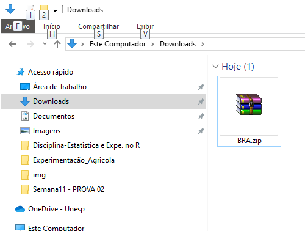

<!-- README.md is generated from README.Rmd. Please edit that file -->

# climate-trace-br

## Aquisição dos dados

  

 \## Carregando Pacotes

``` r
library(tidyverse)
library(geobr)
source("R/gafico.R")
```

## Mesclando base com ids

### Carregando as bases de dados

``` r
emissions_sources <- read_rds("data/emissions_sources.rds")
states <- read_rds("data/states.rds")
```

### Lendo o polígono dos estados

``` r
states  %>%
  ggplot() +
  geom_sf(fill="white", color="black",
          size=.15, show.legend = FALSE) +
  geom_point(
    data = emissions_sources %>%
      filter(sigla_uf %in% c("AC","AM","PA","AP","RR","RO","TO"),
             year == 2020
             ),
    aes(lon,lat)) +
  tema_mapa()
```

<!-- -->
